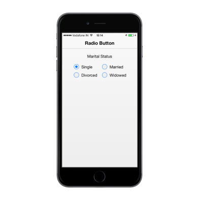
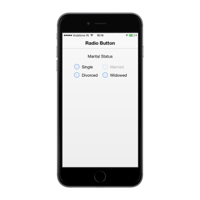
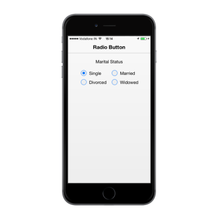

# Easy Customization

## Checked Status

You have options to set the state of the RadioButton either as checked or unchecked. When you select any one option, a dot mark appears inside the circle. This is called the checkedstate. RadioButtons selected earlier are unselected that is they are in uncheckedstate. The checked property is used to set the state of the RadioButton.



 

<b>Marital Status</b>

 

<table>

<tr>

<td width="100px">

@Html.EJMobile().RadioButton("sample_radiobutton", "").Text("Single").Checked(true)

</td>

<td width="100px">

@Html.EJMobile().RadioButton("sample_radiobutton", "").Text("Married ")

</td>

</tr>

<tr>

<td width="100px">

@Html.EJMobile().RadioButton("sample_radiobutton", "").Text("Divorced")

</td>

<td width="100px">

@Html.EJMobile().RadioButton("sample_radiobutton", "").Text("Widowed")

</td>

</tr>

</table>



The following screenshot displays the checkedstatus:

## Enabled

This is a Boolean property that lets you enable or disable the options. When set to false, this prevents you from selecting that particular choice. By default, this property is set to true.



 

<b>Marital Status</b>

 

<table>

<tr>

<td width="100px">

@Html.EJMobile().RadioButton("sample_radiobutton", "").Text("Single")

</td>

<td width="100px">

@Html.EJMobile().RadioButton("sample_radiobutton", "").Text("Married").Enabled(false)

</td>

</tr>

<tr>

<td width="100px">

@Html.EJMobile().RadioButton("sample_radiobutton", "").Text("Divorced")

</td>

<td width="100px">

@Html.EJMobile().RadioButton("sample_radiobutton", "").Text("Widowed")

</td>

</tr>

</table>



The following screenshot displays the disabledRadioButton.

## Customize Label

Specifies the text content for the RadioButton. In previous programs, separate labels are created for each RadioButton. Now, you can set the text for the RadioButton by using the text property. So, here you do not have to add label tag for each RadioButton in the HTML code.



 

<b>Marital Status</b>

 

<table>

<tr>

<td width="100px">

@Html.EJMobile().RadioButton("sample_radiobutton", "").Text("Single")                </td>

<td width="100px">

@Html.EJMobile().RadioButton("sample_radiobutton", "").Text("Married")

</td>

</tr>

<tr>

<td width="100px">

@Html.EJMobile().RadioButton("sample_radiobutton", "").Text("Divorced")

</td>

<td width="100px">

@Html.EJMobile().RadioButton("sample_radiobutton", "").Text("Widowed")

</td>

</tr>

</table>



The following screenshot displays the customized labels in RadioButton.

