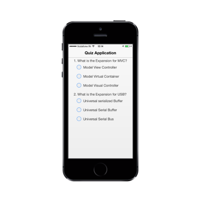
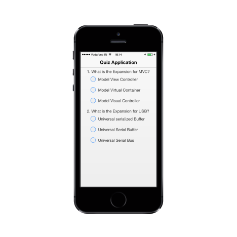

# Getting Started

This section briefly describes you how to create a QuizApp by using the Essential MVC Mobile RadioButton control and features available in it.

## Create your first RadioButton by using MVC

The following guidelines show you how to use the RadioButton to select the answers in the application and get the selected items. The following screenshot displays a sample Quiz application.

### Create the necessary layout

Create a simple MVC application and paste the following header and add the following template inside the <body> tag of the layout.cshtml and paste other templates in the view page for the RadioButton creation.

You can create an MVCProject and add necessary Dlls and script with the help of the [MVC-Getting Started Documentation](http://help.syncfusion.com/js/) for Mobile.

Add the following code layout to the corresponding master page.



@Html.EJMobile().Header("header").Title("Quiz Application")

@RenderBody()

@Html.EJMobile().Scrollpanel("scroll").Target("content")



### Create RadioButton

Add the following code example to render the RadioButton in the quiz application in a corresponding view page.



<!--RadioButton content-->

<table border="0" cellpadding="5">

<tr>

<td>1. What is the Expansion for MVC?

</td>

</tr>

<tr>

<td class="align">

@Html.EJMobile().RadioButton("radbtn", "view", new { id = "radio1" }).Text("Model View Controller")

</td>

</tr>

<tr>

<td class="align">

@Html.EJMobile().RadioButton("radbtn", "virtual", new { id = "radio2" }).Text("Model Virtual Container")

</td>

</tr>

<tr>

<td class="align">

@Html.EJMobile().RadioButton("radbtn", "Visual", new { id = "radio3" }).Text("Model Visual Controller")

</tr>

<tr>

<td>2. What is the Expansion for USB?

</td>

</tr>

<tr>

<td class="align">

@Html.EJMobile().RadioButton("USB", "serialized", new { id = "radio4" }).Text("Universal serialized Buffer")

</td>

</tr>

<tr>

<td class="align">

@Html.EJMobile().RadioButton("USB", "Serial", new { id = "radio5" }).Text("Universal Serial Buffer")

</td>

</tr>

<tr>

<td class="align">

@Html.EJMobile().RadioButton("USB", "Universal", new { id = "radio6" }).Text("Universal Serial Bus")

</td>

</tr>

</table>



Now, add the following style to align the RadioButton and contents properly in the quiz application.





The following screenshot is the output for the above code examples.

