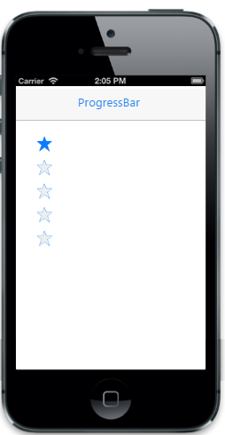

# Customize orientation        

Rating provides support for vertical orientation. By default Rating renders with horizontal orientation. You can the change the orientation by the "Orientation" property.

1. Horizontal.
2. Vertical. 



    @Html.EJMobile().Rating("rating_sample").Orientation(Orientation.Vertical)



The following screenshot displays the output.                        

