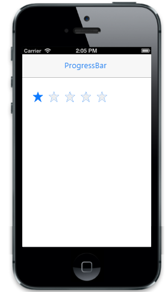

# Customize precision

The Precision property is used to specify how the Rating control can accept its value. The possible values are,

1. Full Precision-accepts rounded value based on the selection.
2. Exact Precision-accepts exact selected value.
3. Half Precision-accepts exact half/rounded value based on the selection (0.5, 1, 1.5, 2, etc.).



    @Html.EJMobile().Rating("rating_sample").Precision(Precision.Exact)



The following screenshot displays the output.                        

