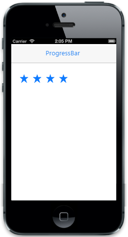

# Customize values                           

The MaximumValue property is used to denote the maximum value up to which the rating can be accepted. The MinimumValue property is used to denote the minimum rating value. The Value property specifies the current selection value. The IncrementStep property specifies the step value incrementation between each rating value (star) selection.



@Html.EJMobile().Rating("rating_sample").MinimumValue(2).MaximumValue(6).Value(4).IncrementStep(1)



The following screenshot displays the output.

