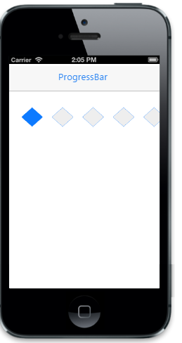

# Customize shape

The Shape property is used to specify the shape of the Rating. The possible values are,

1. Star
2. Circle
3. Diamond
4. Heart
5. Pentagon
6. Square
7. Triangle

The ShapeHeight property specifies the height for the Rating shape. The ShapeWidth property specifies the width of the Rating shape. The SpaceBetweenShapes property specifies the space (padding) between each rating point (element).



@Html.EJMobile().Rating("rating_sample").Shape(Shape.Diamond).ShapeHeight(40).   

ShapeWidth(45).SpaceBetweenShapes(20)



The following screenshot displays the output.                        

