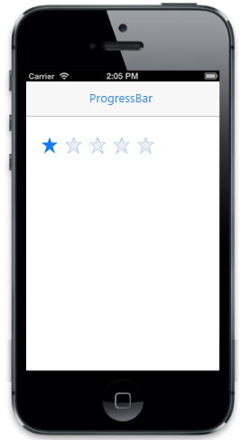

# Disable Rating

The ReadOnly property is used to disable the interaction in the Rating control.  The default value is false.


    
	@Html.EJMobile().Rating("rating_sample").ReadOnly(true)



The following screenshot displays the output:                        

