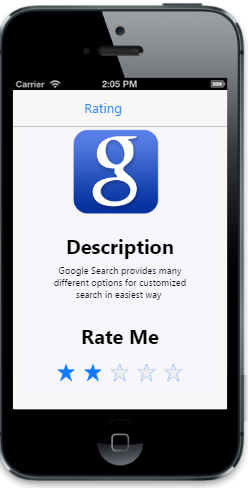

# Getting started

## Create your first Rating control in MVC

The ASP.NET MVC, Mobile Rating Control provides an intuitive Rating experience that allows you to select a number of stars that represent a Rating.

## Create the necessary layout

The following steps guide you to add a Rating control for a mobile application. In this scenario, Rating control is used to rate Google Search mobile app. 

1. Create a simple MVC application and add the following header page content inside the body tag of layout.cshtml. 
2. Creating a MVC Project and adding necessary Dll’s and Scripts is done with the help of the [MVC-Getting Started](https://help.syncfusion.com/aspnetmvc/getting-started) Documentation.
   

   @Html.EJMobile().NavigationBar("header").Title(" Google Search")

    @*Render Rating control*@


   

3. Add the following template to the corresponding view page to create Rating control for this scenario.
   

    

        

            

                <!-- to display the google image -->
            

            

                <h2>
                    Description
                </h2>
                 Google Search provides many different options for customized search in easiest way.
                  
                <h2>
                    Rate Me
                </h2>
            

            <!-- Need to render rating here -->
        

        <!-- Scroll panel -->
        

        

    

<style>
    #image {
        background: url("http://js.syncfusion.com/UG/Mobile/Content/google.png") no-repeat;
        height: 140px;
        width: 140px;
        margin-top: 50px;
    }

    #form h2 {
        font-weight: bold;
    }
   


## Adding Rating control

1. To add a Rating control you need to call “Rating” helper. Initially MobileRating control is rendered with default values of all the properties and you can easily customize MobileRating control by changing their properties according to your requirement.  
   

   
		@Html.EJMobile().Rating("rating")
        

   

2. Execute this code to render a Rating control to rate the application by selecting the stars. For more details, to run the samples refer "Common Getting Started" section.

   

## Set precision

You can customize the Rating precision based on your requirement. You can achieve this by setting the Precision property that allows you to rate more precisely. 

The Rating control supports three precision modes as follows. 

1. In full precision, you can rate the item with complete precise (Example: 1, 2). 
2. In half precision, you can rate the item with half precise (Example: 1.5, 2.5) instead of complete precise. 
3. In exact precision, you can rate the item with exact precise (Example: 3.2, 4.6). In this scenario, you can set the precision mode to Exact.



		 @Html.EJMobile().Rating("rating").Precision(Precision.Exact).Value(2)


   

