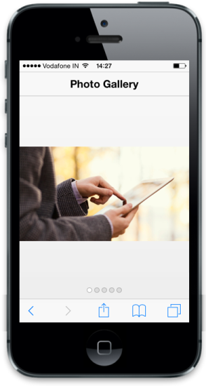

# Customize header

In Rotator you can enable the built-in header support. You can use Title property. You can set the title for NavigationBar using Title property. Refer to the following code example.



<!-- header control -->

@Html.EJMobile().NavigationBar("Header").Mode(NavBarMode.Header).Title("Photo Gallery")

<div id="rotatorcontentdefault">

    

        <div class="photo photo1">

        

    

    

        <div class="photo photo2">

        

    

    

        <div class="photo photo3">

        

    

    

        <div class="photo photo4">

        

    

    

        <div class="photo photo5">

        

    

<div id="scrollparent">

    @{    @Html.EJMobile().Rotator("rotatordefault").TargetId("rotatorcontentdefault");

    }



