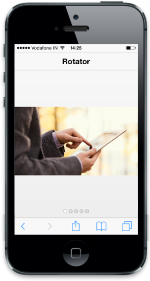

# Data binding

Essential Studio for ASP.NET MVC Mobile Rotator provides support for data binding. Data binding provides a simple and consistent way for applications to present and interact with data. Elements can be bound to data from a variety of data sources.

DataSource is used to get the datasource that holds the Rotator items. Refer to the following code example.



@model List<Images>

<!-- header control -->

 @Html.EJMobile().NavigationBar("Header").Mode(NavBarMode.Header).Title("Rotator")

<div id="rotatorcontentdefault">

    

        <div class="photo {{:imageUrl}}">

        

    

<div id="scrollparent">

    @{     @Html.EJMobile().Rotator("rotatordefault").TargetId("rotatorcontentdefault").DataSource(Model);

    }



