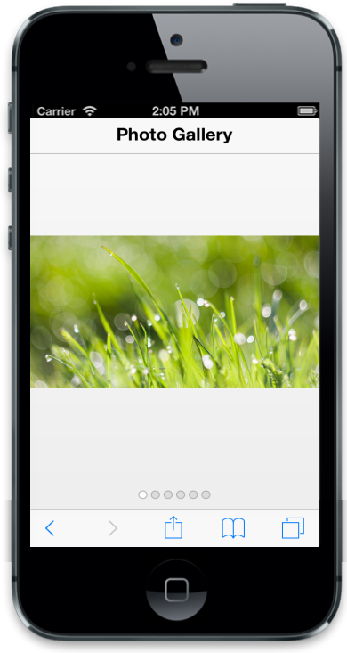
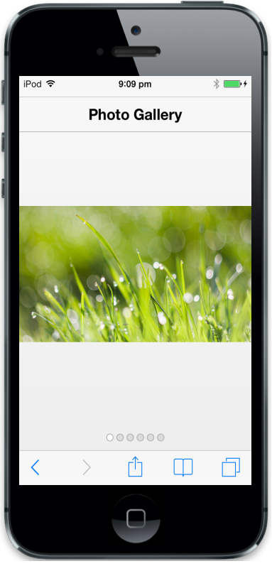
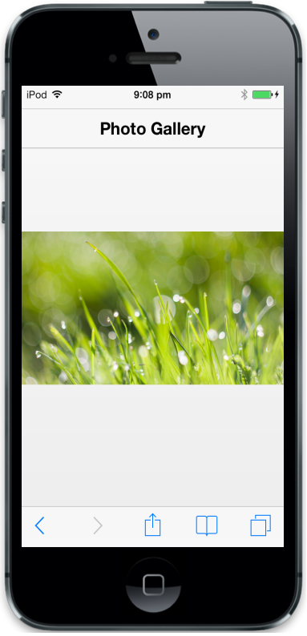
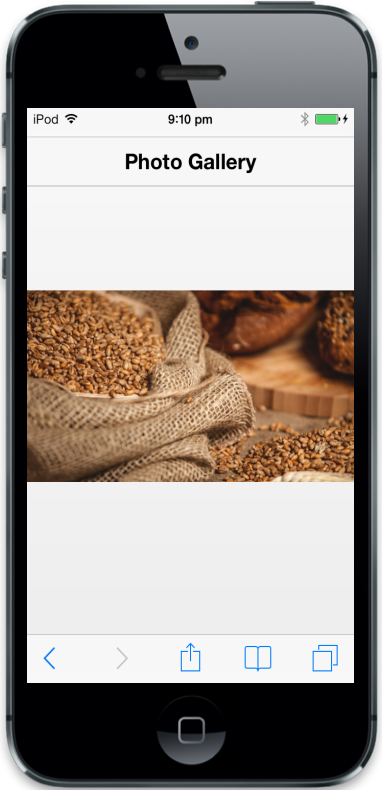

# Getting started

In this section, you can learn how to create Rotator for your mobile app.              

## Create your first Rotator in MVC

The Essential Studio for ASP.NET MVC Mobile Rotator widget is a container that helps you to navigate next and previous items through swipe gestures. Each item in Rotator can hold any html content. In the following guideline, you can learn the features in the Mobile Rotator widget by creating a Photo Gallery App.

### Create the required layout

Rotator control is rendered based on the default values of all the properties. You can customize Rotator control by changing its properties according to your requirement.  

Create a simple MVC application and add the following header page content inside the <Body> tag of layout.cshtml. 

You can create a MVC Project and add necessary Dll’s and Scripts with the help of the [MVC-Getting Started Documentation](http://help.syncfusion.com/aspnetmvc/captcha/getting-started#create-your-first-captcha-in-aspnet-mvc ) for mobile.



<!-- header control -->

@Html.EJMobile().NavigationBar("Header").Mode(NavBarMode.Header).Title("Photo Gallery")

    

        @RenderBody()

    



## Create the Rotator control

To render the Rotator control, set “TargetId” property with the id of the target element that contains the HTML template for each item. Every first level child 
 element of the target element acts as an item of the Rotator. 

To render the Rotator control, add the following code example.



    <!-- View Page Content -->

<div id="rotatorcontentdefault">

    
       

        <div class="photo photo1">

        

    

       

        <div class="photo photo2">

        

    

       

        <div class="photo photo3">

        

    

       

        <div class="photo photo4">

        

    

       

        <div class="photo photo5">

        

    





<!-- Rotator control -->

@Html.EJMobile().Rotator("rotatordefault").TargetId("rotatorcontentdefault") 



Add the following styles to the Rotator items.





Execute the above code to render the following output. 

## Hide the Pager

In the above image, Pager indicates the item that is currently displayed. If you do not want the pager to be displayed,  you can set the ShowPager property to “_false_”.



@Html.EJMobile().Rotator("rotatordefault").TargetId("rotatorcontentdefault").ShowPager(false)



Execute the above code to render the following output. 

By swiping left and right, you can move to the other images in the Photo Gallery.

