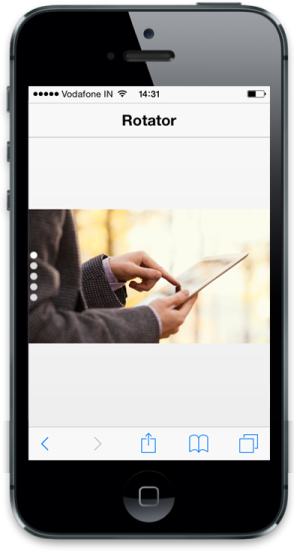

# Orientation

The Orientation property is used to swipe the Rotator in Horizontal and Vertical direction. By default value of Orientation is Horizontal.

The pager is provided to indicate the item that is currently selected from the available number of items. The ShowPager property is used to show the pager. The PagerPosition property is used to specify the pager position according to Orientation. The PagerPosition possible values are as follows.

For Vertical Orientation

* Left
* Right

For Horizontal Orientation

* Top
* Bottom

Refer to the following code example.



<!-- header control -->

 @Html.EJMobile().NavigationBar("Header").Mode(NavBarMode.Header).Title("Rotator")

<div id="rotatorcontentdefault">

    

        <div class="photo photo1">

        

    

    

        <div class="photo photo2">

        

    

    

        <div class="photo photo3">

        

    

    

        <div class="photo photo4">

        

    

    

        <div class="photo photo5">

        

    




<!-- Rotator control -->

<div id="scrollparent">

    @{  

        @Html.EJMobile().Rotator("rotatordefault").TargetId("rotatorcontentdefault").Orientation(Orientation.Vertical).ShowPager(true).PagerPosition(MobilePagerPosition.Left);

    }



Add the following styles to the style section. 

N> You can use the following styles for all the other samples explained as follows.





