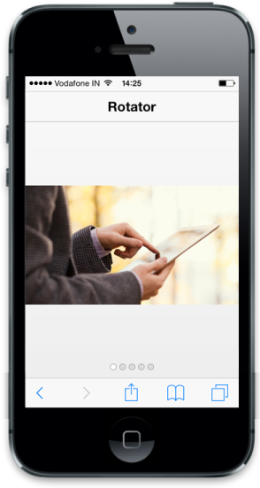

# Render the specified target

You can render the contents for the Rotator by specifying the particular target element. The target element should maintain the HTML structure as mentioned in the following code example.

The TargetId property is used to define the Id of the target element where you can specify the content to render in the control. The TargetHeight and TargetWidth properties are used to specify the Rotator height and width respectively on initialization. Refer to the following code example.



<!-- header control -->

@Html.EJMobile().NavigationBar("Header").Mode(NavBarMode.Header).Title("Rotator")

<div id="rotatorcontentdefault">

    

        <div class="photo photo1">

        

    

    

        <div class="photo photo2">

        

    

    

        <div class="photo photo3">

        

    

    

        <div class="photo photo4">

        

    

    

        <div class="photo photo5">

        

    

 <div id="scrollparent">

    @{

       @Html.EJMobile().Rotator("rotatordefault").TargetId("rotatorcontentdefault");

    }



