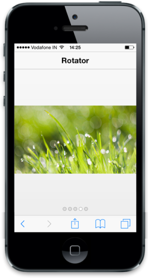

# Select item

Rotator control takes a numeric value given in CurrentItemIndex property and displays the corresponding item that matches the given index. Refer to the following code example.



<!-- header control -->

@Html.EJMobile().NavigationBar("Header").Mode(NavBarMode.Header).Title("Rotator")

<div id="rotatorcontentdefault">

    

        <div class="photo photo1">

        

    

    

        <div class="photo photo2">

        

    

    

        <div class="photo photo3">

        

    

    

        <div class="photo photo4">

        

    

    

        <div class="photo photo5">

        

    

<div id="scrollparent">

    @{         @Html.EJMobile().Rotator("rotatordefault").TargetId("rotatorcontentdefault").CurrentItemIndex(3);

    }



