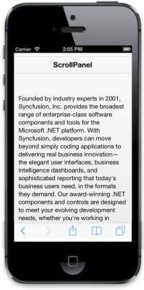

# Customize initial scrolling position	

The “StartX” and “StartY” properties allow you to specify initial position of the scrolling content along x-axis and y-axis respectively. By default, these properties’ values are set to 0. Refer to the following code example.



@Html.EJMobile().Header("sample_header").Title("ScrollPanel")

Founded by industry experts in 2001, Syncfusion, Inc. provides the broadest range of enterprise-class software components and tools for the Microsoft .NET platform. With Syncfusion, developers can move beyond simply coding applications to delivering real business innovation—the elegant user interfaces, business intelligence dashboards, and sophisticated reporting that today's business users need, in the formats they demand. Our award-winning .NET components and controls are designed to meet your evolving development needs, whether you're working in Windows Forms, WPF, ASP.NET, ASP.NET MVC, or Silverlight. At Syncfusion, we uncompromisingly strive for excellence in order to offer the very best value to our customers—from small ISVs to Fortune 100 companies. Our most successful product is Essential Studio.

 

@Html.EJMobile().Scrollpanel("sample_scrollpanel").Target("maincontent").StartY(50).EnableNativeScrolling(false)



The following screenshot displays the ScrollPanel:

