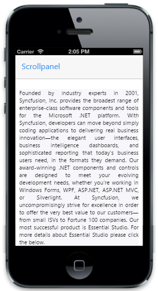
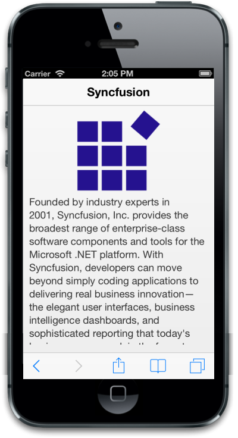

# Getting Started

In this section, you can learn how to create Scroll Panel for your mobile app.

## Create your first ScrollPanel in MVC

The Essential Studio for ASP.NET MVC Mobile ScrollPanel is an interactive panel for scrolling. The ScrollPanel control wraps its contents in a scrollable area, as an object in a GUI, and lets you scroll through continuous text and pictures. It allows you to view it, even when it does not fit into the space of a mobile or computer display.

## Create layout

The Essential Studio for ASP.NET MVC Mobile ScrollPanel widget is rendered based on the default values for all the properties. You can easily customize ScrollPanel control by changing its properties according to your requirements. The following steps guide you to add ScrollPanel for the required content area. Create an MVC Project and add necessary Dlls and script with the help of [MVC-Getting Started Documentation.](https://help.syncfusion.com/aspnetmvc/getting-started) 

1. Add the following header control code in layout.cshtml page.
   

   
		<!-- Header control -->
	  @Html.EJMobile().NavigationBar("header").Title("Scrollpanel")
   

   

2. Add the following code example to the corresponding view page.
   

   
   
		<!-- Content that needs to be scrolled-->
		<div id="content" style="text-align:justify;">
		        

            Founded by industry experts in 2001, Syncfusion, Inc. provides the broadest range of enterprise-class software components and tools for the Microsoft .NET platform. With Syncfusion, developers can move beyond simply coding applications to delivering real business innovation—the elegant user interfaces, business intelligence dashboards, and sophisticated reporting that today's business users need, in the formats they demand. Our award-winning .NET components and controls are designed to meet your evolving development needs, whether you're working in Windows Forms, WPF, ASP.NET, ASP.NET MVC, or Silverlight. At Syncfusion, we uncompromisingly strive for excellence in order to offer the very best value to our customers—from small ISVs to Fortune 100 companies. Our most successful product is Essential Studio. For more details about Essential Studio please click the below.
    

		

		<!— Add scroll panel helper here-->
  

   
   

   
Run the above code example to render the following output.

### Create ScrollPanel

To render the ScrollPanel control, set the Target property with a value that matches the id of the target element and you can add the ScrollPanel to it. 

Add the following code example to the corresponding view page.

<!-- Scroll Panel control -->



@Html.EJMobile().Scrollpanel("ScrollPanel").Target("content")



### Set Panel Height and Width

The TargetHeight and TargetWidth properties describe the height and width of the Target panel respectively. When height or width of the content exceeds the height or width of the Target panel, then you can scroll the contents. 

 <!-- Scroll Panel control -->



  @Html.EJMobile().Scrollpanel("ScrollPanel").Target("content").TargetHeight(400).TargetWidth(300)



Run the above code example and you will see the following output.

### Enable horizontal and vertical Scrolling

The Target content can be scrolled vertically or horizontally or in both ways. The property EnableVerticalScroll enables vertical scrolling and the property EnableHorizontalScroll enables horizontal scrolling.

<!-- Scroll Panel control -->


@Html.EJMobile().Scrollpanel("ScrollPanel").Target("content").EnableHorizontalScroll(true).EnableVerticalScroll(true)


