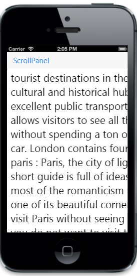

# Zooming

EnableZoom is a Boolean property that lets you specify whether the scrolling content can be zoomed or not. By default, this property is set to “false”. 



        

                       London : London, one of the most popular tourist destinations in the world for a reason. A cultural and historical hub, London has an excellent public transportation system that allows visitors to see all the fantastic sights without spending a ton of money on a rental car.
				     London contains four World Heritage Sites.
            paris  : Paris, the city of lights and love - this short guide is full of ideas for how to make the most of the romanticism that oozes from every one of its beautiful corners.You couldn't possibly visit Paris without seeing the Eiffel Tower.
				     Even if you do not want to visit this world famous structure, you will see its top from all over Paris.

        

 

@Html.EJMobile().Scrollpanel("sample_scrollpanel").Target("maincontent").EnableZoom(true).StartZoom(2).EnableNativeScrolling(false)



The following screenshot displays zooming:

## Zoom Max

ZoomMax property lets you set the maximum limit to which the content can be zoomed. By default, this property is set to 6. 



    

        

                       London : London, one of the most popular tourist destinations in the world for a reason. A cultural and historical hub, London has an excellent public transportation system that allows visitors to see all the fantastic sights without spending a ton of money on a rental car.
				     London contains four World Heritage Sites.
            paris  : Paris, the city of lights and love - this short guide is full of ideas for how to make the most of the romanticism that oozes from every one of its beautiful corners.You couldn't possibly visit Paris without seeing the Eiffel Tower.
				     Even if you do not want to visit this world famous structure, you will see its top from all over Paris.

        

    
 

@Html.EJMobile().Scrollpanel("sample_scrollpanel").Target("maincontent").EnableZoom(true).MaximumZoom(1).StartZoom(2).EnableNativeScrolling(false)



## Zoom Min

This property lets you set the minimum limit to which the content can be zoomed. By default, this property is set to 1. 



    

        

                       London : London, one of the most popular tourist destinations in the world for a reason. A cultural and historical hub, London has an excellent public transportation system that allows visitors to see all the fantastic sights without spending a ton of money on a rental car.
				     London contains four World Heritage Sites.
            paris  : Paris, the city of lights and love - this short guide is full of ideas for how to make the most of the romanticism that oozes from every one of its beautiful corners.You couldn't possibly visit Paris without seeing the Eiffel Tower.
				     Even if you do not want to visit this world famous structure, you will see its top from all over Paris.

        

    
 

@Html.EJMobile().Scrollpanel("sample_scrollpanel").Target("maincontent").EnableZoom(true).MinimumZoom(2).StartZoom(1).EnableNativeScrolling(false)



## Start zoom

This property lets you specify the zooming value on initial rendering of the scrollable content.  By default this property is set to 1. 



    

        

                       London : London, one of the most popular tourist destinations in the world for a reason. A cultural and historical hub, London has an excellent public transportation system that allows visitors to see all the fantastic sights without spending a ton of money on a rental car.
				     London contains four World Heritage Sites.
            paris  : Paris, the city of lights and love - this short guide is full of ideas for how to make the most of the romanticism that oozes from every one of its beautiful corners.You couldn't possibly visit Paris without seeing the Eiffel Tower.
				     Even if you do not want to visit this world famous structure, you will see its top from all over Paris.

        

    
 

@Html.EJMobile().Scrollpanel("sample_scrollpanel").Target("maincontent").EnableZoom(true).StartZoom(2).EnableNativeScrolling(false)



The following screenshot displays the startzoom:

