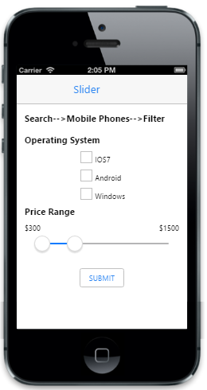
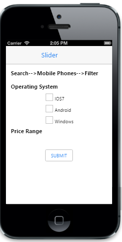
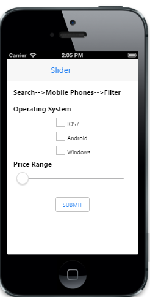
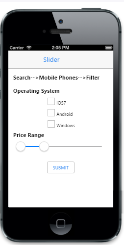
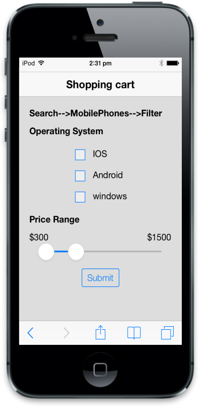
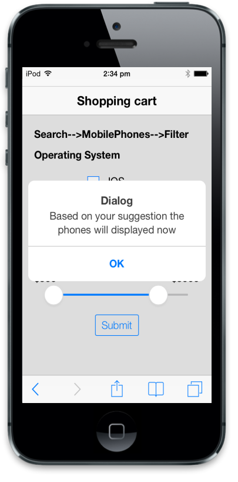

# Getting Started

This section briefly describes how to create and use a Slider in your application.

## Create your first Slider in MVC

The ASP.NET MVC Mobile Slider allows you to select a single value or a range of values using an interface with sliding handles.  The following section describes how to create a shopping cart app and learn the features in Slider widget.

{{ '' | markdownify }}
{:.image }

Create the layout for Shopping cart app	 

You can customize Slider control by changing their properties. In shopping cart app a range slider is used to set price range.

Create a simple MVC application and add the following code example in the <body> tag of Layout.cshtml file.

You can create a MVC project and add necessary DLL’s and scripts with the help of the [MVC Getting Started Documentation.](http://help.syncfusion.com/ug/js/default.htm)

@Html.EJMobile().Header("header").Title("Shopping cart")

    

        

            @RenderBody()

        

    

       @Html.EJMobile().Scrollpanel("scroll").Target("content")

Add the following code example to the corresponding view page.

     

         

             <h1>Search-->MobilePhones-->Filter</h1>

          

           <h1>Operating System</h1>

      

       <!-- create check box for different OS  -->

       

       <table border="0" cellpadding="6">

        <tr>

         @Html.EJMobile().CheckBox("check1").Text("IOS7")

        </tr>

        <tr>

          @Html.EJMobile().CheckBox("check3").Text("Android")

        </tr>

        <tr>

          @Html.EJMobile().CheckBox("check2").Text("Windows")

        </tr>

       </table>

           

           

               <h1>Price Range</h1>

            

            <b>Min:</b>      <b>Max:  </b>

             <!—Add your Slider control here-->

             

             

            @Html.EJMobile().Button("submit").Text("SUBMIT").ClientSideEvents(events => events.TouchEnd("openAlertDialog"))

              

              <!-- dialog control -->

   @Html.EJMobile().Dialog("alert").LeftButtonCaption("OK").ClientSideEvents(events r=> events.ButtonTap("alertClose")).Content(@

      Based on your suggestions the phones will display now

               
).EnableAutoOpen(false)

Execute the above code to render the following output. 

{{ '' | markdownify }}
{:.image }

Create the Slider control

To create the Slider control with a predefined range, add the following code to the view page. In this application you can set the minimum value for the Slider using MinimumValue property as 100, maximum valueusing MaximumValue property as 5000 and the value of IncrementStep property to 100 so that, the slider is moved for every 100 values. 

@Html.EJMobile().Slider("slider1").MinimumValue(100).MaximumValue(5000).IncrementStep(100)

{{ '' | markdownify }}
{:.image }

Create the range slider

In this scenario, you can set EnableRange property to True to set the price range using range slider. You can set the initial range values using Values property as 100, 1500. And set the Slider’s left thumb to 100 and the right thumb to 1500. 

Add the following code to the Slider
 tag.

@Html.EJMobile().Slider("slider").MinimumValue(100).MaximumValue(5000).EnableRange(true).IncrementStep(100).Values(new int[] { 100, 1500 })

Execute the above code to render the following output. 

{{ '' | markdownify }}
{:.image }

Handle slider events

In this shopping cart app, when you move the slider, the corresponding values are updated to the span elements that act as a label for Slider. You can use “Slide” event that is handled by appropriate function. 

Add the following code example to the Slider.

@Html.EJMobile().Slider("slider").MinimumValue(100).MaximumValue(5000).EnableRange(true).IncrementStep(100).Values(new int[] { 100, 1500 }).ClientSideEvents(events => { events.Slide("onSlide"); })

You can get the present value of both the Slider handles at any time using its getValue property.  Add the following code example to the 

Execute the above code to render the following output, when you click submit. 

{{ '' | markdownify }}
{:.image }

