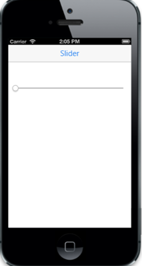

# IOS7 Specific Customization

You can set the IOS7 specific properties to the control by accessing IOS7 property.

## ThumbStyle

ThumbStyle property is used to render the Slider knob in two different styles.  Default value for the property is set to “Normal”.

The possible values are,

1. Normal
2. Small



@Html.EJMobile().Slider("slider_sample").RenderMode(RenderMode.IOS7).IOS7(ios => ios.ThumbStyle(ThumbStyle.Small))



The following screenshot displays the Slider iOS7:

## Orientation

It specifies the Orientation in which the Slider is rendered. By default, the value is set to “horizontal”.

The possible values are,

1. Horizontal
2. Vertical



@Html.EJMobile().Slider("slider_sample").Orientation(Orientation.Vertical)



The following screenshot displays the Slider Orientation:

## Readonly

ReadOnly property makes the Slider control to be fixed. When this property is set to true, the Slider knob cannot be dragged from its current position that is the Slider value cannot be changed.



@Html.EJMobile().Slider("slider_sample").ReadOnly(true)



