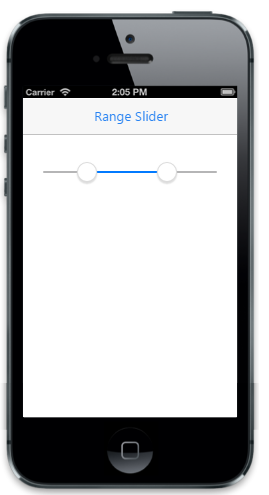

# Range Slider

The “EnableRange” property is used to select the range of values that is from and to values. The “Values” property specifies the “from” and “to” values for the RangeSlider on initialization. Default value of the “EnableRange” property is set to “false”.



    @Html.EJMobile().Slider("slider_sample").EnableRange(true).Values(new int[] {30, 90})



The following screenshot displays the Range of the Slider:

