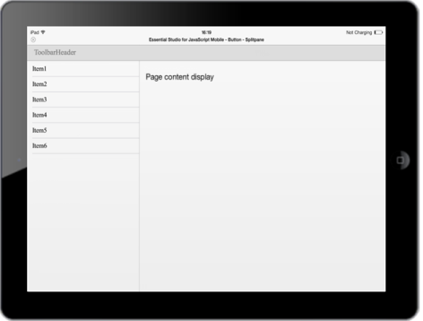

## Android Specific Customization

You can set the android specific properties to the control by using the following settings.

> _Note: In iOS and windows, header control is used to set the title for both left pane and right panel. But in android, toolbar control is used as per the native user interface guideline._

## Customize Toolbar

ShowToolbar property is used to show/hide the toolbar when the control is rendered in android mode. You can customize toolbar title by using this toolbarSettings property. 



@Html.EJMobile().SplitPane("splitpane").RenderMode(RenderMode.Android).ToolbarSettings(tool=>tool.Android(toolbar=>toolbar.Title("ToolbarHeader"))).LeftPaneTemplate(@

    @Html.EJMobile().ListView("listview").ClientSideEvents(c=>c.TouchEnd("loadContent")).ShowHeader(false).Items(items =>

   {

       items.Add().Text("Item1");

       items.Add().Text("Item2");

       items.Add().Text("Item3");

       items.Add().Text("Item4");

       items.Add().Text("Item5");

       items.Add().Text("Item6");

   })

    
)   



Refer to the script section and page content section to load the right pane content of appropriate page created. The following screenshot illustrates the output.

Likewise, you can customize all other properties of toolbar using this property. Refer to the complete UG of toolbar to know its properties.

