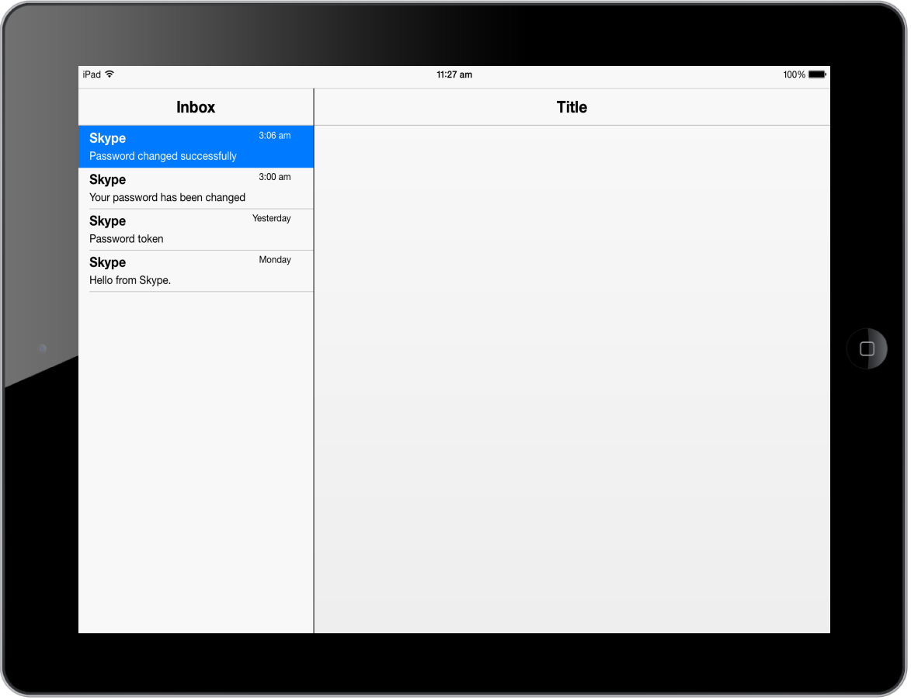

# Getting Started

This section enables you to create SplitPane using JavaScript in your mobile app.

## Create your first SplitPane in MVC

The Essential Studio for ASP.NET MVC Mobile Splitpane divides a region on the web page.  It is configured to split up the horizontal view vertically. Right side panes can display the content from an external URL that is specific to the item selected in the left pane. In the following guidelines, you can learn the features in Splitpane widget by creating a Mail App.

### Create the Splitpane control

The Essential Studio for ASP.NET MVC MobileSplitpane control is rendered by calling the Splitpane Helper. 

Create a simple MVC application and add the following code example in the view page named as SplitPaneSample for Splitpane creation. For creating a MVC Project, adding necessary Dll’s and Scripts can be done with help of the MVC-Getting Started Documentation.



@Html.EJMobile().SplitPane("splitview").LeftPaneTemplate(@

)



Run this code example and the following output is displayed. For more details, to run the samples refer "Common Getting Started" section.

### Add left Pane content

In the Left Pane, you can add listbox for easy navigation. To provide data source for listbox template in the Left Pane content, you can create a ListTemplate.cs file in the model and add the following code example to the file.



    public class ListTemplate

    {

        public string Name { get; set; }

        public string Time { get; set; }

        public string About { get; set; }

        public string Url { get; set; }

    }

    public static class ListTemplateModal

    {

        public static List<ListTemplate> listTempSource = new List<ListTemplate>();

        public static List<ListTemplate> setListTempSource()

        {

            listTempSource.Add(new ListTemplate { Name = "Skype", Time = "3:06 am", About = "Password changed successfully", Url = "load1" });

            listTempSource.Add(new ListTemplate { Name = "Skype", Time = "3:00 am", About = "Your password has been changed", Url = "load2" });

            listTempSource.Add(new ListTemplate { Name = "Skype", Time = "Yesterday", About = "Password token", Url = "load3" });

            listTempSource.Add(new ListTemplate { Name = "Skype", Time = "Monday", About = "Hello from Skype", Url = "load4" });

            return listTempSource;

        }

        public static void clearSource()

        {

            listTempSource.Clear();

        }       

    }



In the controller for the view page, add the following code example.



        public ActionResult SplitPaneSample()

        {

            ListTemplateModal.clearSource();

            return View(ListTemplateModal.setListTempSource());

        }



Create a partial view page with the name “ListViewContent.cshtml” and add the following code example to the file.



@model List<ListTemplate>

@{

@Html.EJMobile().ListView("templatelist").AllowScrolling(true).ShowHeader(false).RenderTemplate(true).DataSource(Model).PersistSelection(true).SelectedItemIndex(0).ClientSideEvents(evt => { evt.TouchEnd("listItemSelect"); }).ContentTemplate(

    @

        {{>Name}} {{>Time}}

        

{{>About}}

        

    
)

}



Title of the Left Pane is set using LeftHeaderSettings property. In this case, you can set the title as “Inbox”. In the same way, you can set the title for Right Pane by using RightHeaderSettings property. In android mode you don’t have header, instead toolbar is present. To set title for toolbar, use the ToolbarSettings property.

Refer the following code example. The partial view (ListViewContent) is called to render the Left Pane content.



@Html.EJMobile().SplitPane("splitview").LeftHeaderSettings(left => left.Title("Inbox")).RightHeaderSettings(right => right.Title("Message")).ToolbarSettings(tool => tool.Android(and => and.Title("Inbox"))).LeftPaneTemplate(@
@Html.Partial("ListViewContent")
)



Use the following styles to apply style for ListView template.





Run this code example and the following output is displayed. For more details, to run the samples refer "Common Getting Started" section.

### Add right Pane content

Refer to the following code example.





Create a view page with name load1.cshtml and add the following code example to the file.



<h2>

    Hi John,</h2>

 

<h3>

    Password successfully changed</h3>

 

Your new Skype password has been set.

 

You can now access your Account, view your call history or change your account settings.

 

 

<h5>

    Talk soon,</h5>

The people at Skype

Create a view page with name load2.cshtml and add the following code example to the file.

<h2>

    Hello John,</h2>

 

<h3>

    Your password has been changed</h3>

 

Your Skype password has been changed. If you did not change this yourself please

contact one of the administrators of the Skype Manager you belong to.

 

 

<h5>

    Talk soon,</h5>

The people at Skype

Create a view page with name load3.cshtml and add the following code example to the file,

<h2>

    Hello John,</h2>

 

<h3>

    Password token</h3>

 

Reset your password with this temporary code. Please note that this link is only

active for 6 hours after receipt. After the time limit expires, the code does not

work and you have to resubmit the password change request. 

 

If the link doesn't work, you can enter the code manually using this token: 45c5chg15ae33c438ch2cc7ehn004hg6

 

 

<h5>

    Talk soon,</h5>

The people at Skype

Create a view page with name load4.cshtml and add the following code example to the file,

<h3>

    Hi John,</h3>

 

<h2>

    Welcome to Skype</h2>

 

Congratulations on joining Skype! Now you can enjoy the magic of free face-to-face

calls, instant messaging, screen sharing and so much more - all with Skype.

 

 

<h5>

    Talk soon,</h5>

The people at Skype



Run this code example and the following output is displayed. For more details, to run the samples refer "Common Getting Started" section.

