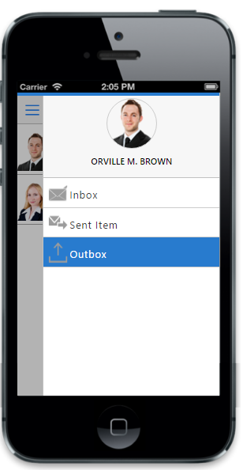
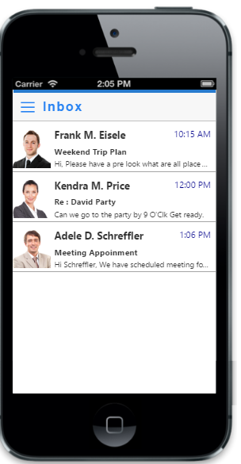

# Getting Started

This section enables you to create SplitPane using JavaScript in your mobile app.

## Create your first SplitPane in MVC

The Essential Studio for ASP.NET MVC Mobile Splitpane divides a region on the web page. 

### Create the Splitpane control

The Essential Studio for ASP.NET MVC MobileSplitpane control is rendered by calling the Splitpane Helper. 

Create a simple MVC application and add the following code example in the view page named as SplitPaneSample for Splitpane creation. For creating a MVC Project, adding necessary Dll’s and Scripts can be done with help of the MVC-Getting Started Documentation.



    @Html.EJMobile().SplitPane("defaultsplitpane").LeftPane(lp => lp.TemplateId("splitpaneleftPane").ShowOnTablet(false)).ContentPane(cP => cP.TemplateId("splitpanecontentPane"))



### Add left Pane content

The ShowOnTablet property is used to specifies the leftpane visibility for tablet devices.LeftPane property is used to open from left side window on swipe.


    
    
    

    

    <script>
        function _optionClick(e) {
            switch (e.data.text) {
                case "Inbox":
                    $("#list").ejmListView("option", "dataSource", window.listData);
                    break;
                case "Sent Item":
                    $("#list").ejmListView("option", "dataSource", window.sentItemData);
                    break;
                case "Outbox":
                    $("#list").ejmListView("option", "dataSource", window.outboxData);
                    break;
            }
            $("#mailHeadText").text(e.data.text);
            $("#defaultsplitpane").ejmSplitPane("closePane");
            $("#navContentScroll").ejmScrollPanel("scrollTo", 0, 0);
        }

        function onNavOpen() {
            $("#defaultsplitpane").ejmSplitPane("openLeftPane");
        }

window.listData = [
    {
        "name": "Frank M. Eisele ",
        "class": "brooke",
        "time": "10:15 AM",
        "subject": "Weekend Trip Plan",
        "description": "Hi, Please have a pre look what are all place gonna visit."
    },
    {
        "name": "Kendra M. Price",
        "class": "claire",
        "time": "12:00 PM",
        "subject": "Re : David Party",
        "description": "Can we go to the party by 9 O'Clk Get ready."
    },
    {
        "name": "Adele D. Schreffler",
        "class": "erik",
        "time": "1:06 PM",
        "subject": "Meeting Appoinment",
        "description": "Hi Schreffler, We have scheduled meeting for our discussion."
    }];
    window.sentItemData = [

    {
        "name": "David J. Thomas",
        "class": "jacob",
        "time": "4:03 PM",
        "subject": "Re : Home Page Design",
        "description": "I applied those updates, here's the latest design for the homepage."
    },
    {
        "name": "Harriett T. Jolley",
        "class": "claire",
        "time": "12:00 PM",
        "subject": "Re : David Party",
        "description": "Can we go to the party by 9 O'Clk Get ready."
    }];
    window.outboxData = [
    {
        "name": "Frank M. Eisele ",
        "class": "brooke",
        "time": "10:15 AM",
        "subject": "Weekend Trip Plan",
        "description": "Hi, Please have a pre look what are all place gonna visit."
    },
    
    {
        "name": "June R. Carter",
        "class": "grace",
        "time": "2:11 PM",
        "subject": "Fw : Critical Update",
        "description": "Deeds, Please receive the critical from the host."
    }];



Use the following styles to apply style for Splitpane.



.default.splitpane #userimg
{
    background-image: url("../sample/splitpane/brooke.png");
    background-position: center top;
    background-repeat: no-repeat;
    background-size: 100% 100%;
    border: 1px solid #ccc;
    border-radius: 50%;
    height: 80px;
    margin: 0 auto;
    width: 80px;
}

.default.splitpane #username
{
    margin-top: 10px;
    width: 100%;
    text-align: center;
    text-transform: uppercase;
    font-weight: 600;
}

.default.splitpane #list .e-m-lv
{
    background-color: white;
}

.default.splitpane #list .e-m-lv-item
{
    border-bottom: 1px solid #a5a5a5;
    padding: 5px 0px;
}

.default.splitpane #splitHeader .e-m-navbar-text
{
    letter-spacing: 2px;
    font-weight: 600;
    font-family: sans-serif;
}

.default.splitpane .lst-time
{
    color: darkblue;
    position: absolute;
    right: 8px;
    top: 5px;
}

.default.splitpane .e-m-lv-active .item-lst
{
    color: #fff;
}

.default.splitpane .item-lst
{
    color: #333;
    display: block;
    font-family: Helvetica Neue, Helvetica;
    font-size: 14px;
    min-height: 68px;
    position: relative;
}

.default.splitpane .item-lst span
{
    display: block;
}

.default.splitpane .lst-ima
{
    bottom: 0;
    left: 0;
    position: absolute;
    top: 5;
    width: 65px;
}

.default.splitpane .lst-content
{
    bottom: 0;
    left: 66px;
    position: absolute;
    right: 0;
    top: 0;
}

.default.splitpane .lst-name
{
    font-size: 16px;
    font-weight: bold;
    margin-top: 5px;
}

.default.splitpane .lst-des
{
    font-size: 12px;
    margin-top: 3px;
    text-overflow: ellipsis;
    padding-right: 10px;
    white-space: nowrap;
    overflow: hidden;
}

.default.splitpane .lst-sub
{
    font-size: 13px;
    font-weight: bold;
    margin-top: 7px;
}

.default.splitpane .opt-img
{
    width: 38px;
    left: 0;
}

.default.splitpane .opt-lst
{
    height: 47px;
    display: block;
    border-bottom: 1px solid #ccc;
    padding-top: 5px;
    font-family: sans-serif;
    font-size: 16px;
    font-weight: 600;
}

.default.splitpane .opt-lst span
{
    display: block;
    color: #333;
    letter-spacing: 1px;
}

.default.splitpane .e-m-lv-active .opt-lst span
{
    color: #fff;
}

.default.splitpane .opt-name
{
    padding-top: 10px;
}

.default.splitpane .opt-content
{
    position: absolute;
    left: 36px;
    right: 0;
    top: 0;
    bottom: 0;
    padding: 5px;
}

.default.splitpane .opt-img img
{
    background-repeat: no-repeat;
    bottom: 7px;
    display: block;
    height: 51px;
    padding: 7px;
    position: relative;
    width: 45px;
}

.default.splitpane #contentscroll
{
    background: #fff;
}

.default.splitpane .nav-icon::before
{
    font-size: 22px;
}

.default.splitpane .e-m-windows.nav-icon::before
{
    color: #000;
}
.default.splitpane .e-m-android.nav-icon
{
    position: absolute;
    left: 4px;
    top: 13px;
}
.default.splitpane .e-m-windows.nav-icon, .default.splitpane .e-m-flat.nav-icon
{
    position: absolute;
    left: 5px;
}
.default.splitpane .e-m-flat.nav-icon
{
    top: 11px;
}
.default.splitpane .e-m-android.nav-icon::before
{
    color: #fff;
    font-size: 32px;
}

.default.splitpane .e-m-flat.nav-icon::before
{
    color: #fff;
}
.default.splitpane .e-m-ios7.nav-icon
{
    position: absolute;
    left: 6px;
    top: 6px;
}

.default.splitpane .e-m-ios7.nav-icon::before
{
    color: #2883f2;
}



Run the above code to display the Splitpane with left side.

### Add right Pane content

To open the content from right side,you can use  RightPane property.



    @Html.EJMobile().SplitPane("defaultsplitpane").RightPane(lp => lp.TemplateId("splitpaneleftPane").ShowOnTablet(false)).ContentPane(cP => cP.TemplateId("splitpanecontentPane"))

    @*Use the above content and styles*@




        function onNavOpen() {
            $("#defaultsplitpane").ejmSplitPane("openLeftPane");
        }



Run the above code to display the Splitpane with right side.

