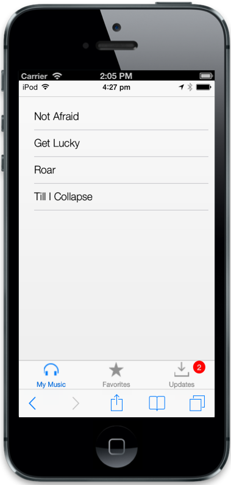
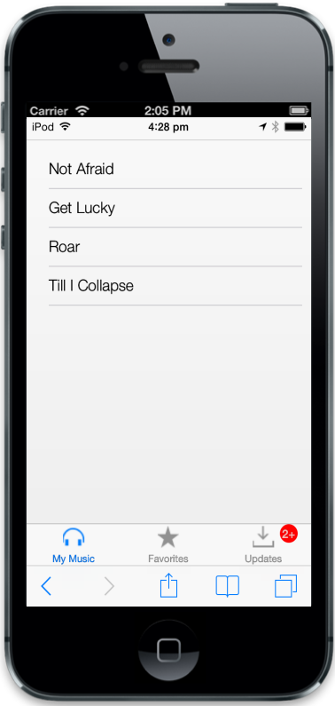

## Customize Badge

To know the number of updates available in the specific Tab item before viewing it, it is notified through the Badge support. 

Enabled

The enabled property is used to enable or disable the badge in the Tab. Default value is set to false.

Value

The value property is used to set the badge value to a Tab item. Default value is set to 0. You can refer the following code example. 

@Html.EJMobile().Tab("tab").RenderMode(RenderMode.IOS7).Items(item =>{

item.Add().Text("My Music").Href("#mymusic").IOS7(ios7=>ios7.ImageClass("icn-Mymusic"));

item.Add().Text("Favorites").Href("#favorites").IOS7(ios7 => ios7.ImageClass("icn-Favorites"));

item.Add().Text("Updates").Href("#updates").IOS7(ios7 => ios7.ImageClass("icn-Updates")).Badge(badge => badge.Enabled(true).Value(2));

       })

<!-- Tab first item -->

@Html.EJMobile().ListView("mymusic").ShowHeader(false).Items(item =>

            {

                item.Add().Text("Not Afraid");

                item.Add().Text("Get Lucky");

                item.Add().Text("Roar");

                item.Add().Text("Till I Collapse");

            })

<!-- Tab second item -->

@Html.EJMobile().ListView("favorites").ShowHeader(false).Items(item =>

            {

                item.Add().Text("Dark Horse");

                item.Add().Text("Roar");

            })

<!-- Tab third item -->

@Html.EJMobile().ListView("updates").ShowHeader(false).Items(item =>

            {

                item.Add().Text("New songs available for download");

                item.Add().Text("1.2.1 update available");

            })

The following screenshot displays the Customization of Badge:

{{ '' | markdownify }}
{:.image }

MaxValue

The MaxValue property is used to set the maximum badge value to a Tab item. Default value is set to 100. 

 [MVC]

@Html.EJMobile().Tab("tab").RenderMode(RenderMode.IOS7).Items(item =>{

item.Add().Text("My Music").Href("#mymusic").IOS7(ios7=>ios7.ImageClass("icn-Mymusic"));

item.Add().Text("Favorites").Href("#favorites").IOS7(ios7 => ios7.ImageClass("icn-Favorites"));

item.Add().Text("Updates").Href("#updates").IOS7(ios7 => ios7.ImageClass("icn-Updates")).Badge(badge => badge.Enabled(true).Value(3).MaximumValue(2));

       })

<!-- Tab first item -->

@Html.EJMobile().ListView("mymusic").ShowHeader(false).Items(item =>

            {

                item.Add().Text("Not Afraid");

                item.Add().Text("Get Lucky");

                item.Add().Text("Roar");

                item.Add().Text("Till I Collapse");

            })

<!-- Tab second item -->

@Html.EJMobile().ListView("favorites").ShowHeader(false).Items(item =>

            {

                item.Add().Text("Dark Horse");

                item.Add().Text("Roar");

            })

<!-- Tab third item -->

@Html.EJMobile().ListView("updates").ShowHeader(false).Items(item =>

            {

                item.Add().Text("New songs available for download");

                item.Add().Text("1.2.1 update available");

                item.Add().Text("1.2.2 update available");

            })

The following screenshot displays the MaxValue:

{{ '' | markdownify }}
{:.image }

