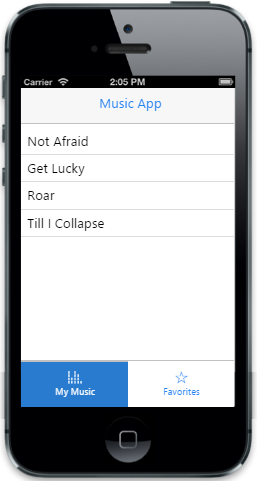
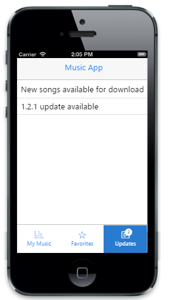

# Getting Started

In this section you will learn how to create the Essential JavaScript Mobile Tab and how to use it in your application.

## Create your first Tab in MVC

The Essential Studio for ASP.NET MVC Mobile Tab provides a way to switch views within a web page. In the following guidelines, you can create Music App (simulator) through that you can learn the features of mobileTab widget.

In the above screenshot , you can switch between different view from single webpage. You can also load Tabs on demand by specifing the url to be loaded.

### Create Tabs for Music app

The Essential Studio for ASP.NET MVC Mobile Tab widget is rendered either by specifying static content or by using on demand contents by specifying the respective url. On either case Tab control is rendered based on the default values for all the properties. You can easily customize Tab control by changing its properties according to your requirement. 

In this Music App three tabs are required. One is for displaying the available music; one is for listing out the favorite tracks that you have marked and the last one is for displaying the updates on the Music App. The following steps guide you to create a basic Tab in your application. For creating a MVC Project, adding necessary Dll’s and Scripts can be done with help of the following [MVC-Getting Started Documentation](http://help.syncfusion.com/js/) for mobile.

Add the following Layout code to the corresponding layout view page.



@Html.EJMobile().Header("header").HideForUnSupportedDevice(true).Position(MobileHeaderPosition.Normal).Title("Music App")

    

       <!-- Adds Tab Elements here -->

    

@Html.EJMobile().Scrollpanel("scrollpanel").Target("content")

To render the Tab control, you add the following code example in the corresponding view page and specify the list of Tab items to be added in the “Items” API. Specify a value for “Text” property to set text for each item.

<!-- Tab control -->

@Html.EJMobile().Tab("tabdefault").Android(a => a.Position(ControlPosition.Normal)).Windows(w => w.Position(ControlPosition.Normal)).Items(item =>

            {

                item.Add().Text("My Music");

                item.Add().Text("Favorites");

            })



You can specify the “Href” property for specifying the content to be loaded on each Tab. This property should match with the “id” of the element where you have specified the Tab content. In this case, The Essential Studio for ASP.NET MVC Mobile ListView controls with ids “mymusic” and “favorites” that is given in the “Href” attribute for the respective items are used and the third Tab that loads the content dynamically from a given url.

N> Regarding the third Tab in the “loading on demand content section” is discussed later.



<!-- Tab control -->

@Html.EJMobile().Tab("tabdefault").Android(a => a.Position(ControlPosition.Normal)).Windows(w => w.Position(ControlPosition.Normal)).Items(item =>

            {

                item.Add().Text("My Music").Href("#mymusic");

                item.Add().Text("Favorites").Href("#favorites");

            })

<!-- Tab1 -->

@Html.EJMobile().ListView("mymusic").ShowHeader(false).Items(item =>

            {

                item.Add().Text("Not Afraid");

                item.Add().Text("Get Lucky");

                item.Add().Text("Roar");

                item.Add().Text("Till I Collapse");

            })

<!-- Tab2 -->

@Html.EJMobile().ListView("favorites").ShowHeader(false).Items(item =>

            {

                item.Add().Text("Dark Horse");

                item.Add().Text("Roar");

            })



Run this code and the following output is achieved. For more details, to run the samples refer "Common Getting Started" section.

### Add Images to the Tabs

To provide images for your mobileTab widget, you can specify the image class for individual items in the Tab. 

The following code example explains how to add images to the Tabs.



@Html.EJMobile().Tab("tabdefault").Android(a => a.Position(ControlPosition.Normal)).Windows(w => w.Position(ControlPosition.Normal)).Items(item =>

{

item.Add().Text("My Music").Href("#mymusic").IOS7(ios7=>ios7.ImageClass("icn-Mymusic"));

item.Add().Text("Favorites").Href("#favorites").IOS7(ios7 => ios7.ImageClass("icn-Favorites"));

       })



Use the following styles for adding the image to Tab.





Run this code and the following output is achieved. For more details, to run the samples refer to "Common Getting Started" section.

### Add on Demand content for updates Tab

On some scenarios you may have to load the content of the Tab only when they are required. In this case, the updates Tab needs to be loaded only when you want to check for updates. For loading content on demand you can specify “EnableAjax” property to ‘true’ and specify the url to load on demand for individual items in the Tab by using the “Href” property.

Refer the following code example to achieve this.



@Html.EJMobile().Tab("tabdefault").Android(a => a.Position(ControlPosition.Normal)).Windows(w => w.Position(ControlPosition.Normal)).Items(item =>

            {

item.Add().Text("My Music").Href("#mymusic").IOS7(ios7=>ios7.ImageClass("icn-Mymusic"));

item.Add().Text("Favorites").Href("#favorites").IOS7(ios7 => ios7.ImageClass("icn-Favorites"));

                item.Add().Text("Updates").Href("Home/Updates").EnableAjax (true).IOS7(ios7 => ios7.ImageClass("icn-Updates"));

            })



Create a view page with the following code example.



@Html.EJMobile().ListView("updates").ShowHeader(false).Items(item =>

            {

                item.Add().Text("New songs available for download");

                item.Add().Text("1.2.1 update available");

            })



Run this code and the following output is achieved. For more details, to run the samples refer to "Common Getting Started" section.

### Set Badge value for updates Tab

In a real-time Music App use case, to display the number of available updates before the user decides to view the Tab, you can set Enabled to ‘true’ and set the desired Badge value in the Value property. 

Use the following code example to initialize the Badge values.



@Html.EJMobile().Tab("tabdefault").Android(a => a.Position(ControlPosition.Normal)).Windows(w => w.Position(ControlPosition.Normal)).Items(item =>

{

item.Add().Text("My Music").Href("#mymusic").IOS7(ios7=>ios7.ImageClass("icn-Mymusic"));

item.Add().Text("Favorites").Href("#favorites").IOS7(ios7 => ios7.ImageClass("icn-Favorites"));

             item.Add().Text("Updates").Href("Home/Updates").Badge(badge => { badge.Enabled(true); badge.Value(2); }).EnableAjax (true).IOS7(ios7 => ios7.ImageClass("icn-Updates"));

         })



Run this code and the following output is achieved. For more details, to run the samples refer "Common Getting Started" section.

To update the Badge value dynamically whenever a new update is added, use the following code example.





After calling the above script you can get the updated Badge as shown in the following screenshot.

