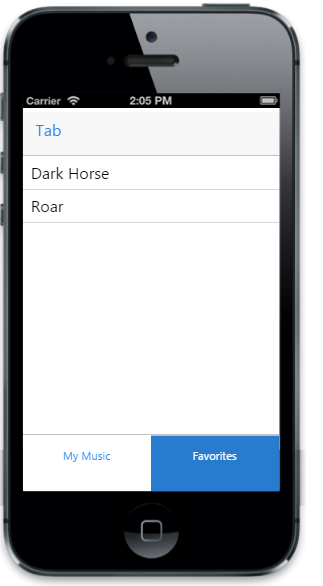

# Select item

Tab control takes a numeric value given in selectedItemIndex property and selects the corresponding item that matches the given index. Default value for SelectedItemIndex property is set to 0. You can refer the following code example. 



        @Html.EJMobile().ListView("mymusic").Items(items =>
           {
               items.Add().Text("Not Afraid");
               items.Add().Text("Get Lucky");
               items.Add().Text("Roar");
               items.Add().Text("Matrix");
               items.Add().Text("Till I Collapse");
           })
        @Html.EJMobile().ListView("favourite").Items(items =>
           {
               items.Add().Text("Dark Horse");
               items.Add().Text("Roar");
           })
        @Html.EJMobile().Tab("tabdefault").Position(MobileTabPosition.Bottom).SelectedItemIndex(1).ContentId("tabdefault-container").Items(tabItem =>
                {
                    tabItem.Add().Text("My Music").Href("#mymusic");
                    tabItem.Add().Text("Favorites").Href("#favourite");
                })
        

        



The following screenshot displays the Selected Items:

