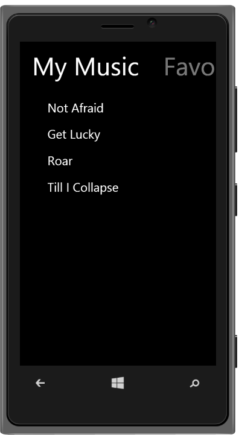
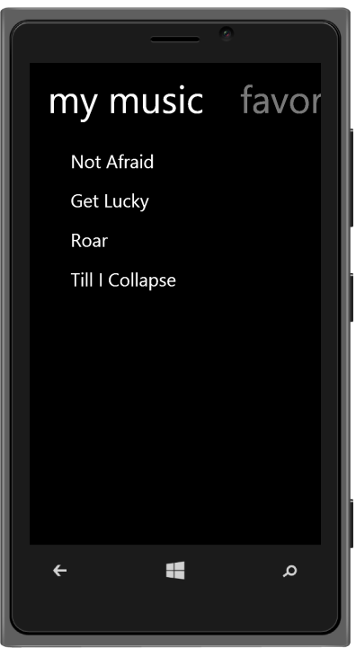

# Windows specific customization

Set the Windows specific properties to the control by accessing this property.

## EnableCustomText

In the Windows phone, by default the Tab title's text is in the lower case irrespective of whatever case is used for the title. To disable this behavior, set the “windows.enablecustomtext”property to true. Default value is set to false. 



@Html.EJMobile().Tab("tab").RenderMode(RenderMode.Windows).Windows(windows=>windows.EnableCustomText(true))

   .Items(item =>{

    item.Add().Text("My Music").Href("#mymusic");

    item.Add().Text("Favorites").Href("#favorites");

    item.Add().Text("Updates").Href("#updates");

       })

<!-- Tab first item -->

@Html.EJMobile().ListView("mymusic").RenderMode(RenderMode.Windows).ShowHeader(false).Items(item =>

            {

                item.Add().Text("Not Afraid");

                item.Add().Text("Get Lucky");

                item.Add().Text("Roar");

                item.Add().Text("Till I Collapse");

            })

<!-- Tab second item -->

@Html.EJMobile().ListView("favorites").RenderMode(RenderMode.Windows).ShowHeader(false).Items(item =>

            {

                item.Add().Text("Dark Horse");

                item.Add().Text("Roar");

            })

<!-- Tab third item -->

@Html.EJMobile().ListView("updates").RenderMode(RenderMode.Windows).ShowHeader(false).Items(item =>

            {

                item.Add().Text("New songs available for download");

                item.Add().Text("1.2.1 update available");

            })



The following screenshot displays window specific customization:

## Position

The Position property holds fixed and normal values. Normal position allows relative position of the element to the appview and fixed position allows fixed position of the element. Default position is set to fixed. 



@Html.EJMobile().Tab("tab").RenderMode(RenderMode.Windows).Windows(windows=>windows.Position(ControlPosition.Normal))

    .Items(item =>{

    item.Add().Text("My Music").Href("#mymusic");

    item.Add().Text("Favorites").Href("#favorites");

    item.Add().Text("Updates").Href("#updates");

       })

<!-- Tab first item -->

@Html.EJMobile().ListView("mymusic").RenderMode(RenderMode.Windows).ShowHeader(false).Items(item =>

            {

                item.Add().Text("Not Afraid");

                item.Add().Text("Get Lucky");

                item.Add().Text("Roar");

                item.Add().Text("Till I Collapse");

            })

<!-- Tab second item -->

@Html.EJMobile().ListView("favorites").RenderMode(RenderMode.Windows).ShowHeader(false).Items(item =>

            {

                item.Add().Text("Dark Horse");

                item.Add().Text("Roar");

            })

<!-- Tab third item -->

@Html.EJMobile().ListView("updates").RenderMode(RenderMode.Windows).ShowHeader(false).Items(item =>

            {

                item.Add().Text("New songs available for download");

                item.Add().Text("1.2.1 update available");

            })



The following screenshot displays the Window Specific Customization Position:

