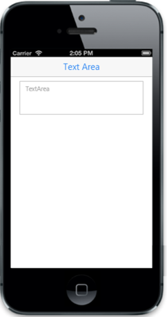

# Customize watermark text

WatermarkText property customizes the text that appears in the background of the TextArea. It acts like a label for the TextArea.

Refer to the following code example.



@Html.EJMobile().TextArea("mailMessage").WatermarkText("TextArea")



