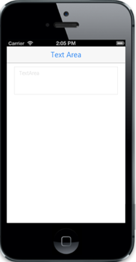

# Enable and disable

Enabled property enables or disables the TextArea control. The default value is true.

Refer to the following code example.



@Html.EJMobile().TextArea("mailMessage").WatermarkText("TextArea").Enabled(false)



