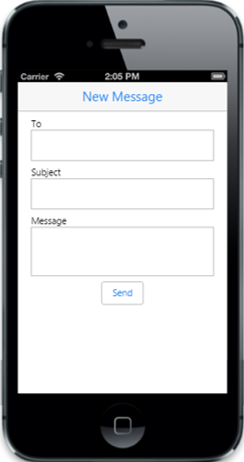

# Getting Started

This section briefly describes how to create Essential MVC Mobile TextArea widget in a simple mobile application for new mail creation process.

## Create your first TextArea in MVC

From the following guidelines, you can create basic Mail sending form by using the TextArea control.

In the above image, message field is rendered by using the TextArea.

### Create the necessary layout 

Create a simple MVC application and add the following header and scrollpanel layout page content inside the <body> tag of layout.cshtml. To create a MVC Project, add necessary Dll’s and Scripts with the help of [MVC-Getting Started Documentation](https://help.syncfusion.com/aspnetmvc/getting-started) for mobile.

Create an HTML file and add the following template to the HTML file.



<!-- header control -->          
@Html.EJMobile().NavigationBar("mailheader").Title("New Message")

    

        To

        @Html.EJMobile().TextBox("mailTo")

        Subject

        @Html.EJMobile().TextBox("mailSubject")

        Message
    <!-- Add TextArea elements here -->          

        

            @Html.EJMobile().Button("submit").Text("Send")

        

    



### Create textarea

Add the following Layout code to the corresponding view page.                                     



    <!-- TextArea element -->
@Html.EJMobile().TextArea("mailMessage")



Add the following styles to show the TextArea control in an order.





Run this code example and you can see the following output.

