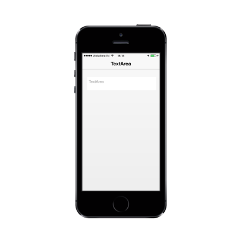

# Border style

The BorderStyle property is used to decide the style of the border.

Refer to the following code example.



  @Html.EJMobile().TextArea("mailMessage").BorderStyle(MobileTextboxBorderStyle.None).WatermarkText("Textarea")



