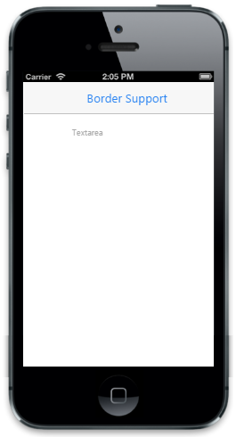

## Show Border

ShowBorder property decides whether the Textbox border can be visible or hidden. The default value is true.

Refer to the following code example.



    @Html.EJMobile().TextArea("mailMessage").WatermarkText("TextArea").ShowBorder(false)



{{ '' | markdownify }}
{:.image }

