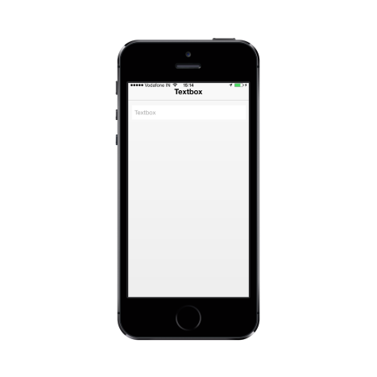

# Border style

The 'BorderStyle' property is used to decide the style of the border.

Refer to the following code example.



   @Html.EJMobile().TextBox("textbox_sample").WatermarkText("Textbox").BorderStyle(MobileTextboxBorderStyle.None).Width("200px")



The following screenshot displays the ShowBorder property.

