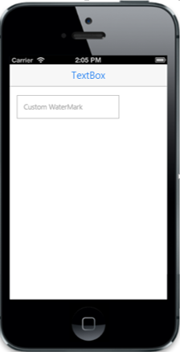

# Customize watermark text

The WatermarkText property is used in customize the text that appears in the background of the Textbox. It acts like a label for the Textbox.

Refer to the following code example.



    @Html.EJMobile().TextBox("textbox_sample").WatermarkText("Custom WaterMark").Width("200px")



The following screenshot displays the customization of the text with WatermarkText property.

