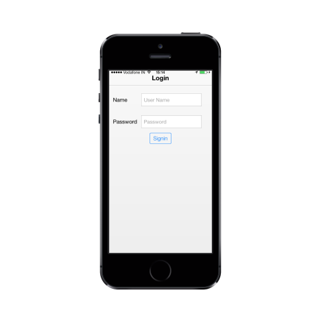

# Getting Started

This section briefly describes how to create Essential MVC Mobile Textbox widget.

## Create your first Textbox Widget in MVC

To create a textbox for the login page in the mobile application, follow the guidelines given. 

### Create the layout

Create an MVC application and add the following code example in the <body> tag of layout.cshtml file.

You can create a MVC project and add the necessary DLLs and scripts with the help of the [MVC Getting Started Documentation.](https://help.syncfusion.com/aspnetmvc/getting-started)



@Html.EJMobile().NavigationBar("header").Title("Login")

<table class="editors">

<tbody>

<tr>

<td>

	<label>

		Name

	</label>

</td>

<td>

	<!--Add Textbox control-->

</td>

</tr>

<tr>

<td>

	<label>

		Password

	</label>

</td>

<td>

	<!--Password Control-->

	@Html.EJMobile().PassWord("password").WatermarkText("Password").Width("200px")                           

</td>

</tr>

</tbody>

</table>

<!--Button Control-->                    

@Html.EJMobile().Button("button").Text("Login")



## Add Textbox Control

To create the Textbox control, add the following code.



@Html.EJMobile().TextBox("textbox_sample").WatermarkText("User Name").Width("200px")



Run the code and get the following output.

