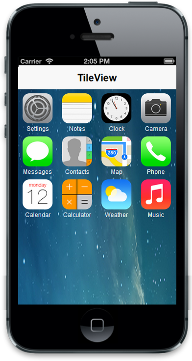
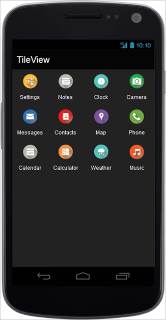
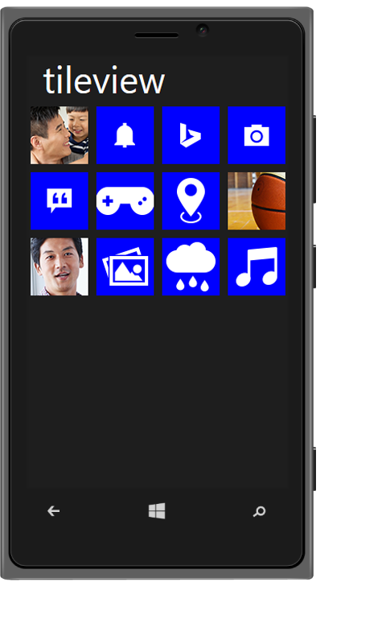
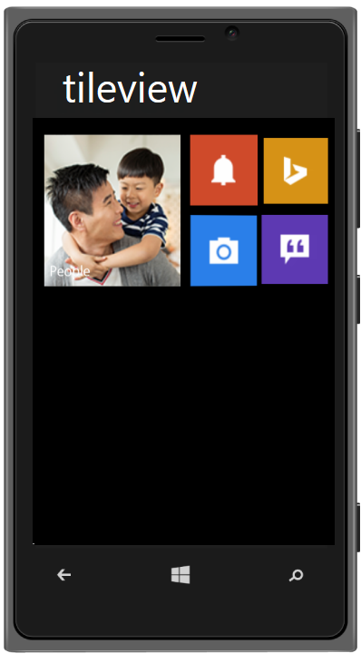

## Add Group Tiles

You can use the following pre-defined classes to change a tile as grouped tile. Using this you can achieve the alignment of group tiles automatically instead of writing your own css classes.

<table>
<tr>
<td>
Class Name</td><td>
Explanation</td></tr>
<tr>
<td>
group</td><td>
To group the column elements</td></tr>
<tr>
<td>
column</td><td>
To align the tile in column manner</td></tr>
<tr>
<td>
small-col-2</td><td>
To align the small size tiles in windows mode</td></tr>
</table>
Default usage:

&lt;div class="group"&gt;

    &lt;div class="column"&gt;

           &lt;!— Add tile control here --&gt;

    &lt;/div&gt;

&lt;/div&gt;

To render column grouped tile, render the number of tiles inside a div element with class ‘column’. Then append that column group element to a div with class ‘group’.                                                            

 Refer to the following code example.

&lt;div class="defaultsample" style="margin-top: 45px;"&gt;

@Html.EJMobile().Header("head").Title("Tileview")

       &lt;div class="group"&gt;

            &lt;div class="column"&gt;

                @Html.EJMobile().Tile("tile1").Theme(Theme.Dark).ImageUrl("setting.png").ImagePath(Url.Content("~/themes/sample/tileview")).Text("Settings")

                @Html.EJMobile().Tile("tile2").Theme(Theme.Dark).ImageUrl("notes.png").ImagePath(Url.Content("~/themes/sample/tileview")).Text("Notes")

                @Html.EJMobile().Tile("tile3").Theme(Theme.Dark).ImageUrl("clock.png").ImagePath(Url.Content("~/themes/sample/tileview")).Text("Clock")

                @Html.EJMobile().Tile("tile4").Theme(Theme.Dark).ImageUrl("camera.png").ImagePath(Url.Content("~/themes/sample/tileview")).Text("Camera")

                @Html.EJMobile().Tile("tile5").Theme(Theme.Dark).ImageUrl("messaging.png").ImagePath(Url.Content("~/themes/sample/tileview")).Text("Messages")

                @Html.EJMobile().Tile("tile6").Theme(Theme.Dark).ImageUrl("contact.png").ImagePath(Url.Content("~/themes/sample/tileview")).Text("Contacts")

                @Html.EJMobile().Tile("tile7").Theme(Theme.Dark).ImageUrl("map.png").ImagePath(Url.Content("~/themes/sample/tileview")).Text("Map")

                @Html.EJMobile().Tile("tile8").Theme(Theme.Dark).ImageUrl("phone.png").ImagePath(Url.Content("~/themes/sample/tileview")).Text("Phone")

            &lt;/div&gt;

            &lt;div class="column"&gt;

                @Html.EJMobile().Tile("tile9").Theme(Theme.Dark).ImageUrl("calendar.png").ImagePath(Url.Content("~/themes/sample/tileview")).Text("Calender")

                @Html.EJMobile().Tile("tile10").Theme(Theme.Dark).ImageUrl("calculator.png").ImagePath(Url.Content("~/themes/sample/tileview")).Text("Calculator")

                @Html.EJMobile().Tile("tile11").Theme(Theme.Dark).ImageUrl("weather.png").ImagePath(Url.Content("~/themes/sample/tileview")).Text("Weather")

                @Html.EJMobile().Tile("tile12").Theme(Theme.Dark).ImageUrl("music.png").ImagePath(Url.Content("~/themes/sample/tileview")).Text("Music")

            &lt;/div&gt;

        &lt;/div&gt;

&lt;/div&gt;

    &lt;style&gt;

        .e-m-ios7 .defaultsample {

            background: url("../themes/sample/tileview/ios7/bg.png") no-repeat scroll 0 0 / 100% 100% rgba(0, 0, 0, 0);

            height: 690px;

            width: 100%;

            position: absolute;

        }

        .e-m-ios7 .e-m-tile.e-m-tile-wrapper-small .e-m-tile-image {

            background-size: 60px 60px;

        }

        .e-m-ios7 .e-m-tile

        {

            margin-left:-3px;

        }

        .e-m-windows .group

        {

            padding:0 2%;

        }

    &lt;/style&gt;

&lt;script&gt;

        if (ej.getRenderMode() == "windows") {

            $($('.group').find('div[data-role="ejmtile"]')).attr({ 'data-ej-backgroundcolor': 'blue' });

        }

        if (ej.getRenderMode() == "android")

            $($('.group').find('div[data-role="ejmtile"]')).attr({ 'data-ej-theme': 'light' });

&lt;/script&gt;

The following screenshots illustrates the output of the above code.

{  | markdownify }
{:.image }

{  | markdownify }
{:.image }

{  | markdownify }
{:.image }

To render small-col-2 grouped tile, render the number of tiles inside a div element with class ‘small-col-2’ and append that small-col-2 group element to a div with class ‘column’. Now, append those column inside the main group div element. It is used for windows mode only.

Refer to the following code example.

@Html.EJMobile().Header("head").Title("Tileview")

&lt;div class="defaultsample" style="margin-top: 45px;"&gt;

&lt;div class="group"&gt;

                &lt;div class="column"&gt;

                    @Html.EJMobile().Tile("tile1").ImageUrl("setting.png").ImagePath(Url.Content("~/themes/sample/tileview")).Text("people").TileSize(TileSize.Medium).BackgroundColor("green")

                    &lt;div class="small-col-2"&gt;

                        @Html.EJMobile().Tile("tile2").ImageUrl("notes.png").ImagePath(Url.Content("~/themes/sample/tileview")).Text("Notes").BackgroundColor("rgb(208, 75, 43)")

                        @Html.EJMobile().Tile("tile3").ImageUrl("clock.png").ImagePath(Url.Content("~/themes/sample/tileview")).Text("Clock").BackgroundColor("rgb(215, 147, 23)")

                        @Html.EJMobile().Tile("tile4").ImageUrl("camera.png").ImagePath(Url.Content("~/themes/sample/tileview")).Text("Camera").BackgroundColor("rgb(43, 128, 234)")

                        @Html.EJMobile().Tile("tile5").ImageUrl("messaging.png").ImagePath(Url.Content("~/themes/sample/tileview")).Text("Messages").BackgroundColor("rgb(94, 58, 179)")

                    &lt;/div&gt;

                &lt;/div&gt;

              &lt;/div&gt;  

            &lt;/div&gt;

The following screenshot illustrates the output of the above code.

{  | markdownify }
{:.image }

