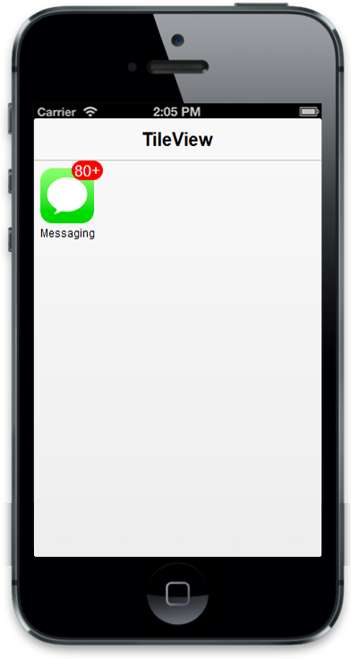

## Configure Badge

The Badge property handles badge specific functionalities like enable or disable the badge and setting badge value for tile. The Text property isusedtoset the text instead of number for tile badge. The MaxValue and MinValue properties areusedto set the maximum and minimum badge value to a tile respectively. 

Refer to the following code example.

@Html.EJMobile().Header("head").Title("Tileview")

@Html.EJMobile().Tile("tile").ImageUrl("messaging.png").ImagePath(Url.Content("~/themes/sample/tileview")).Text("Messaging").Badge(badge => { badge.Enabled(true).MaxValue(80).MinValue(10).Value(88); })

The following screenshot illustrates the output of the above code.

{{ '' | markdownify }}
{:.image }

