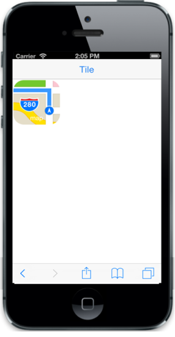

# Customize size

You can customize the size of tile by using TileSize property. The following built-in tile sizes are supported.

* Medium
* Small
* Large
* Wide

Default value: Small

Refer to the following code example.



@Html.EJMobile().NavigationBar("head").Title("Tileview")

 @Html.EJMobile().Tile("tile").ImageUrl("map.png").ImagePath(Url.Content("http://js.syncfusion.com/UG/Mobile/Content/tile")).TileSize(TileSize.Medium).ImagePosition(TileImagePosition.Fill).Text("map")



The following screenshot illustrates the output of the above code.

