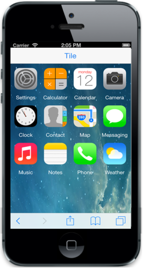
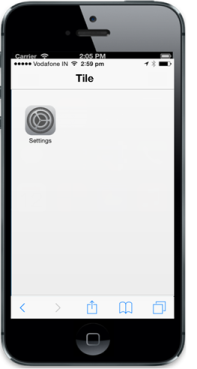

# Getting Started 

## Create your first Tile in MVC

This section explains briefly about how to create a Mobile **Tile** in your MVC application. The **Tile** can be easily configured to the div element in which the tiles are placed. Tapping or selecting a **Tile** launches the app or other experience that is represented by the **Tile**. The following screenshot illustrates the functionality of a **Tile** with a list of the apps provided in the mobile device.

The following steps guide you in adding a Tile control.

### Creating basic mobile layout

Refer [MVC-Getting Started Documentation](https://help.syncfusion.com/aspnetmvc/getting-started) to create a MVC Project, add necessary Dll’s and Scripts.

Add the following code example in layout page of the application.



    <!-- Add Header Control Here -->

    

           <!--Render Tile control-->

    

	


Add Header control for Tile

Add the following code in layout.cshtml page.



   @Html.EJMobile().NavigationBar("header").Title("Tile")



Add a Tile control

To add a Tile control, call Tile helper. You can set images for Tile by using ImageUrl property.

Add the following code to the corresponding view page.



    

        @Html.EJMobile().Tile("tile1").ImageUrl("setting.png").ShowRoundedCorner(true).ImagePosition(TileImagePosition.Fill).ImagePath("http://js.syncfusion.com/UG/Mobile/Content/tile").ImagePosition(TileImagePosition.Fill).Caption(c => c.Alignment(TextAlignment.Left).Text("Settings")).TileSize(TileSize.Small)

    



### Create Tile as grouped tile

In this scenario, you require different sizes of Tiles aligned in a grid-like manner. Here, you can add Tiles with the desired size to make the exact output. The Tile gets aligned automatically based on the size it gets rendered. 

Refer to the following code example.



     <!--Adding Multiple Tiles -->

    

        @Html.EJMobile().Tile("tile1").ImageUrl("setting.png").ImagePath("http://js.syncfusion.com/UG/Mobile/Content/tile").ImagePosition(TileImagePosition.Fill).Caption(c => c.Alignment(TextAlignment.Left).Text("Settings")).TileSize(TileSize.Small).ShowRoundedCorner(true)

        @Html.EJMobile().Tile("tile2").ImageUrl("calculator.png").ImagePath("http://js.syncfusion.com/UG/Mobile/Content/tile").ImagePosition(TileImagePosition.Fill).Caption(c => c.Alignment(TextAlignment.Left).Text("Calculator")).TileSize(TileSize.Small).ShowRoundedCorner(true)

        @Html.EJMobile().Tile("tile3").ImageUrl("calendar.png").ImagePath("http://js.syncfusion.com/UG/Mobile/Content/tile").ImagePosition(TileImagePosition.Fill).Caption(c => c.Alignment(TextAlignment.Left).Text("Calendar")).TileSize(TileSize.Small).ShowRoundedCorner(true)

        @Html.EJMobile().Tile("tile4").ImageUrl("camera.png").ImagePath("http://js.syncfusion.com/UG/Mobile/Content/tile").ImagePosition(TileImagePosition.Fill).Caption(c => c.Alignment(TextAlignment.Left).Text("Camera")).TileSize(TileSize.Small).ShowRoundedCorner(true)

        @Html.EJMobile().Tile("tile5").ImageUrl("clock.png").ImagePath("http://js.syncfusion.com/UG/Mobile/Content/tile").ImagePosition(TileImagePosition.Fill).Caption(c => c.Alignment(TextAlignment.Left).Text("Clock")).TileSize(TileSize.Small).ShowRoundedCorner(true)

       @Html.EJMobile().Tile("tile6").ImageUrl("contact.png").ImagePath("http://js.syncfusion.com/UG/Mobile/Content/tile").ImagePosition(TileImagePosition.Fill).Caption(c => c.Alignment(TextAlignment.Left).Text("Contacts")).TileSize(TileSize.Small).ShowRoundedCorner(true)

        @Html.EJMobile().Tile("tile7").ImageUrl("map.png").ImagePath("http://js.syncfusion.com/UG/Mobile/Content/tile").ImagePosition(TileImagePosition.Fill).Caption(c => c.Alignment(TextAlignment.Left).Text("Map")).TileSize(TileSize.Small).ShowRoundedCorner(true)

        @Html.EJMobile().Tile("tile8").ImageUrl("messaging.png").ImagePath("http://js.syncfusion.com/UG/Mobile/Content/tile").ImagePosition(TileImagePosition.Fill).Caption(c => c.Alignment(TextAlignment.Left).Text("Messaging")).TileSize(TileSize.Small).ShowRoundedCorner(true)

        @Html.EJMobile().Tile("tile9").ImageUrl("music.png").ImagePath("http://js.syncfusion.com/UG/Mobile/Content/tile").ImagePosition(TileImagePosition.Fill).Caption(c => c.Alignment(TextAlignment.Left).Text("Music")).TileSize(TileSize.Small).ShowRoundedCorner(true)

        @Html.EJMobile().Tile("tile10").ImageUrl("notes.png").ImagePath("http://js.syncfusion.com/UG/Mobile/Content/tile").ImagePosition(TileImagePosition.Fill).Caption(c => c.Alignment(TextAlignment.Left).Text("Notes")).TileSize(TileSize.Small).ShowRoundedCorner(true)

        @Html.EJMobile().Tile("tile11").ImageUrl("phone.png").ImagePath("http://js.syncfusion.com/UG/Mobile/Content/tile").ImagePosition(TileImagePosition.Fill).Caption(c => c.Alignment(TextAlignment.Left).Text("Phone")).TileSize(TileSize.Small).ShowRoundedCorner(true)

        @Html.EJMobile().Tile("tile12").ImageUrl("weather.png").ImagePath("http://js.syncfusion.com/UG/Mobile/Content/tile").ImagePosition(TileImagePosition.Fill).Caption(c => c.Alignment(TextAlignment.Left).Text("Weather")).TileSize(TileSize.Small).ShowRoundedCorner(true)

    

    @Html.EJMobile().Scrollpanel("scroll").Target("scrollcontent")



Add the following style for setting the background image for all Tiles (page background).





Run the above code to render the following output. To know how to run the code, refer to this [section](http://help.syncfusion.com/js/)

