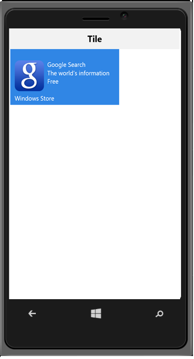

# Template support

ImageTemplateId and CaptionTemplateId properties are used to customize the image and caption/description of a tile by providing the specific template id respectively. 

Refer to the following code example.



 

@Html.EJMobile().NavigationBar("head").Title("Tile")

  @Html.EJMobile().Tile("tileview1").BackgroundColor("#3086e5").Caption(c => c.Alignment(TextAlignment.Center).Text("Weather")).TileSize(TileSize.Wide).ImageTemplateId("imageTemplate")

    

        

        

        

            Google Search 
            The world’s information 
            Free
        

    


Refer the below code snippets for CSS classes


 #appimage {
            background-image: url("../themes/sampleimages/rating/google.png");
            background-repeat: no-repeat;
            width: 70px;
            height: 70px;
            background-size: 100%;
            float: left;
        }

        #imageTemplate {
            margin-top: 35px;
            margin-left: 10px;
        }

        .tileMargin {
            padding-left: 77px;
            color: white;
        }

The following screenshot illustrates the output of the above code.

