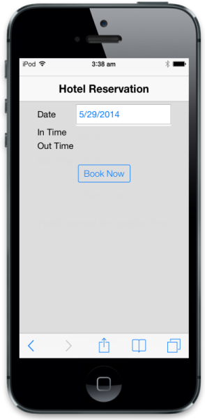
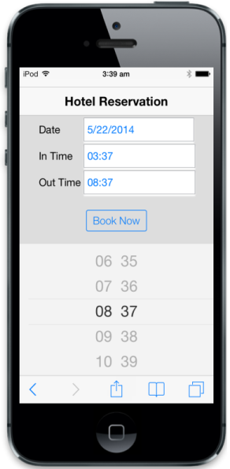
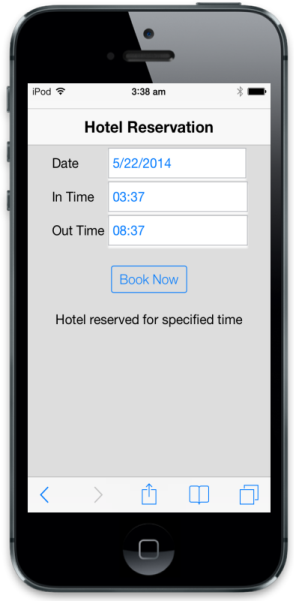

# Getting Started

This section briefly describes you on how to create the Essential Studio for ASP.NET MVC, Mobile TimePicker control in your application.

## Create your first TimePicker in MVC

The ASP.NET MVC TimePicker provides support to display the TimePicker element within your web page and allows you to pick the time. From the following guidelines, you can learn how to customize two TimePickers for a real time hotel reservation scenario. The following screenshot demonstrates the functionality of TimePicker.

### Create the necessary layout

You can create ASP.NET MVCTimePicker widget easily by using MobileTimepickerHTML helper.

Create a simple MVC application and add the following header content inside the <Body>tag of layout.cshtml. You can create a MVC Project and add necessary Dlls and scripts using [MVC-Getting Started Documentation.](http://help.syncfusion.com/aspnetmvc/captcha/getting-started#create-your-first-captcha-in-aspnet-mvc )



@Html.EJMobile().Header("header").Title("Hotel Reservation").Position(MobileHeaderPosition.Normal)

   

@RenderBody()

  



Add the following code example to the corresponding view page. Here you can add two TimePickers to specify InTime and OutTime.



       

<table>

             <tr>

                <td class="tdclass">Date</td>

                <td class="innerclass">

                    

               <!-- Creating DatePicker to select the booking date -->

                 @Html.EJMobile().DatePicker("entryDate")").Value("01/01/2000")

                    

                </td>

             </tr>

             <tr>

                <td class="tdclass">In Time</td>

                <td class="innerclass">

                    

                <!-- Add InTime Timepicker control here -->

                    

                </td>

             </tr>

             <tr>

                <td class="tdclass">Out Time </td>

                <td class="innerclass">

                    

                <!-- Add OutTime Timepicker control here -->

                    

                </td>

             </tr>

        </table>

           

               <!-- Creating button to reserve the hotel -->

                @Html.EJMobile().Button("button").Text("Book Now").RenderMode(RenderMode.Auto).ClientSideEvents(evt=>evt.TouchEnd("displayConfirmation"))

          
                                                                        
 



Run the above code to render the following output.

### Create a TimePicker

To render the TimePicker control, you can add the following code example. Here two TimePickers are added to specify InTime and OutTime.



  <!-- InTime Timepicker element -->

      @Html.EJMobile().TimePicker("startTime").HourMode(HourFormat.TwentyFour).Value("11:00")

  <!-- OutTime Timepicker element -->

      @Html.EJMobile().TimePicker("endTime").HourMode(HourFormat.TwentyFour).Value("21:00")



Apply the following styles to align the MVCMobileTimePicker.



<table>
<tr>
<td>
     </td></tr>
<tr>
<td>
</td></tr>
</table>



Run the above code and focus on InTime or OutTimeTimePicker element (here OutTime element is focused) to render the following output.

### Set the Hour Format

The TimePicker widget supports both 12 hour and 24 hour time format. The default value is 24 hour format. In this case, the booking table opens for all time throughout the day. You can refer the following code example to set 24 hour format using “HourFormat” property and add it to corresponding view page.



  <!-- InTime Timepicker element -->

       @Html.EJMobile().TimePicker("startTime").HourMode(HourFormat.TwentyFour)

  <!-- OutTime Timepicker element -->

       @Html.EJMobile().TimePicker("endTime").HourMode(HourFormat.TwentyFour)



Run this code and focus on InTime or OutTimeTimePicker element (here OutTime element is focused) to render the following output.

Refer the following code example to display a confirmation message by clicking the Book button handled by the button touch and event. 




@Html.EJMobile().Dialog("alertdlg").Title("Booking Confirmation").Mode(DialogMode.Alert).LeftButtonCaption("OK").EnableModal(true).EnableAutoOpen(false).Content(@
Hotel reserved for specified time
).ClientSideEvents(evt => { evt.ButtonTap("alertClose"); })








Run the above code and click Book Now button to render the confirmation message as displayed in the following screenshot.

You can also add additional functionalities to TimePicker like time formats.

