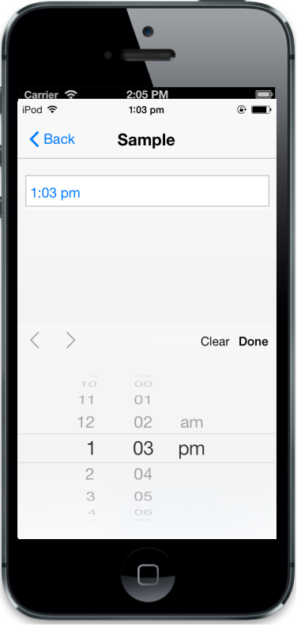

## Native TimePicker

The RenderDefault property is used to enable iOS7 native TimePicker instead of the Syncfusion’sTimePicker; but by using iOS7 native TimePicker, you cannot customize theme, etc. The default value is false.

@Html.EJMobile().TimePicker("timepicker").RenderMode(RenderMode.IOS7).IOS7(IOS7 => IOS7.RenderDefault(true)).HourFormat(HourFormat.Twelve)

The following screenshot displays the output.

{{ '' | markdownify }}
{:.image }

