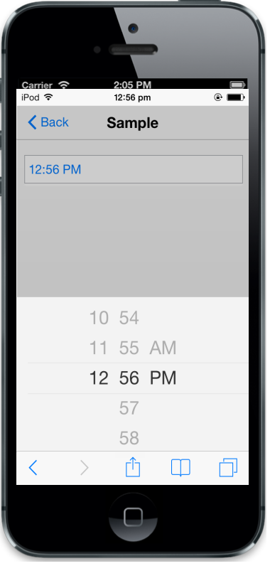

# Time Settings                                               

The value property is used to set the initial time for the TimePicker. The default value is set to the current system time. The HourFormat property allows you to set twelve or twenty four-hour format. The time format can be customized by using TimeFormat property.



 @Html.EJMobile().TimePicker("timepicker").Value("12:56 PM").HourFormat(HourFormat.Twelve).TimeFormat("hh:mm tt")



The following screenshot displays the output.

