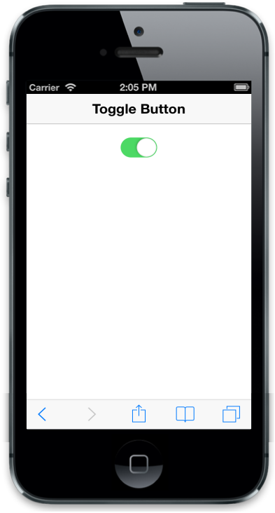

# Animate

Animate property specifies the transition effect for state change. When you set this property to false, no animation occurs when changing the state of Toggle Button (ON/OFF). Default value is true. You can refer to the following code example.



@Html.EJMobile().ToggleButton("togglebutton_sample").Animate(false)



The following screenshot displays the Animate Toggle Button:

