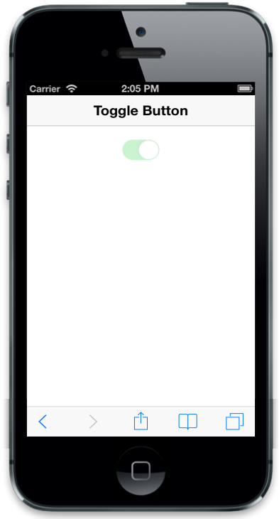

# Enable

Enabled property specifies whether to Enable or Disable the control. When you set this property to false, the control renders in disabled mode. Default value is set to true.



@Html.EJMobile().ToggleButton("togglebutton_sample").Enabled(false)



The following screenshot displays the Enable Toggle Button:

