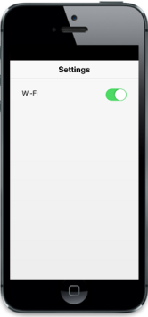
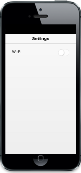
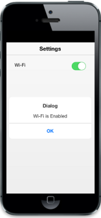

# Getting Started

This section briefly describes about how to create a Toggle button and how to use it in your application.

## Create your first Toggle Button in MVC

The ASP.NET MVC Mobile Toggle Button functions, to switch On/Off functions such as Wi - Fi, Bluetooth in mobile.

## Create Toggle Button for Settings

The Toggle Button widget is rendered based on the default values for all the properties. You can easily customize Toggle Button control by changing its properties. The following steps explain you to add a Toggle button for the Settings scenario where you can enable or disable Wi-Fi connectivity.

Add the following code to the corresponding Layout.cshtml page.



 <!-- Header control -->

@Html.EJMobile().Header("header").Title("Settings") .Position(MobileHeaderPosition.Normal)

  @RenderBody()  

<!-- Scroll Panel control -->

@Html.EJMobile().Scrollpanel("scrollpanel").Target("content")



To render Toggle Button control, add the following code to the corresponding view page. 



<!-- Toggle Button control -->

        

            Wi-Fi

        

        

            @Html.EJMobile().ToggleButton("toggle").ToggleState(true)

        

    



Execute the above code to render the following output.

## Change Toggle Button rendering state

You can customize the initial Toggle Button rendering state by setting the ToggleState property to false that accepts Boolean value as its argument.

Add the following code to set the ToggleState property.



<!-- Toggle Button control -->

  

            @Html.EJMobile().ToggleButton("toggle").ToggleState(false)
  



Execute the above code to render the following output.

## Handle Events

In this application, when the Toggle Button state is changed, a dialog appears to notify the Wi-Fi state is enabled or disabled. This is achieved by using the ClientSideEvents property. Whenever the Toggle Button’s state changes, the Change event is raised. This event is handled by using appropriate functions.

Add the following code to render the dialog when the toggle state is changed.




<!-- Toggle Button control -->

            @Html.EJMobile().ToggleButton("toggle").ToggleState(false).ClientSideEvents(evt => { evt.Change("showDialog"); })

        

<!--Dialog Control-->

//to create dialog object

@{

    @Html.EJMobile().Dialog("dialog").Mode(DialogMode.Alert).EnableAutoOpen(false).EnableModal(false).LeftButtonCaption("OK").Content((@
Wi-Fi is Enabled
)).ClientSideEvents(evt => { evt.ButtonTap("alertClose"); }) 

}








Execute the above code to render the following output.

