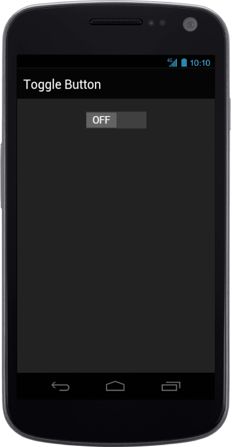

# ToggleState

ToggleState property is used to set the state of the Toggle Button in which the control should render initially. When this property set to false, the control renders with OFFstate, otherwise it will render with ON state. By default, the control renders with ONstate.



@Html.EJMobile().ToggleButton("togglebutton_sample").ToggleState(false)



The following screenshot displays the ToggleState:

