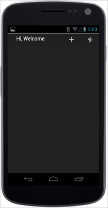
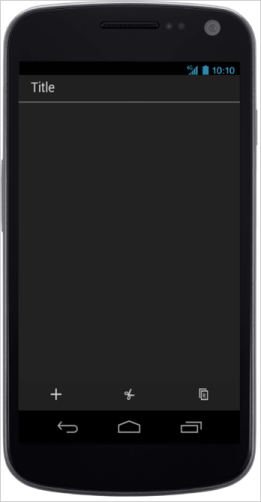
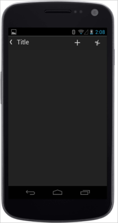
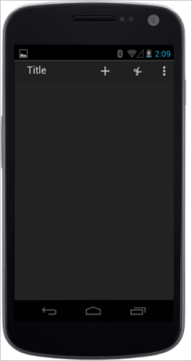
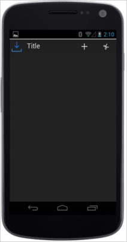

# Android specific customization

You can set the Android specific properties to the control by means of accessing Android property.

## Templating

You can customize the Toolbar left side content by using templating feature. This is achieved by setting TemplateId property that specifies the id of the template element.

Refer to the following code example.



@Html.EJMobile().Toolbar("toolbar_sample").RenderMode(RenderMode.Android).TemplateId("sample1").Items(items =>

   {

       items.Add().IconName(IconName.Add);

       items.Add().IconName(IconName.Cut);

   })

Hi, Welcome



 The following screenshot illustrates the output of the above code.

## EnableSplitView

The EnableSplitView property separates the title and the toolbar items that is displayed at the bottom of the page. You can change the title text by setting the desired title for Title property

Refer to the following code example.



@Html.EJMobile().Toolbar("toolbar_sample").RenderMode(RenderMode.Android).Android(android=>android.EnableSplitView(true)).Items(items =>

   {

       items.Add().IconName(IconName.Add);

       items.Add().IconName(IconName.Cut);

       items.Add().IconName(IconName.Copy);

       items.Add().IconName(IconName.Save);

       items.Add().IconName(IconName.Search);

   })



 The following screenshot illustrates the output of the above code.

When you use Android type toolbar, it can be displayed with navigator icon that is used for navigating to the previous page. To enable this, you can use ShowBackNavigator property.

Refer to the following code example.



@Html.EJMobile().Toolbar("toolbar_sample").RenderMode(RenderMode.Android).Android(android=>android.ShowBackNavigator(true)).Items(items =>

   {

       items.Add().IconName(IconName.Add);

       items.Add().IconName(IconName.Cut);

       items.Add().IconName(IconName.Copy);

       items.Add().IconName(IconName.Save);

       items.Add().IconName(IconName.Search);

   })



 The following screenshot illustrates the output of the above code.

When the number of items is more, the toolbar can’t display all the items. Since it doesn’t fit the device width. Therefore, the over flowed items can be displayed as a menu when you click the ellipsis present in the Toolbar. To display the ellipsis, enable the ShowEllipsis property. 

Refer to the following code example.



@Html.EJMobile().Toolbar("toolbar_sample").RenderMode(RenderMode.Android).Android(android=>android.ShowEllipsis(true)).Items(items =>

   {

       items.Add().IconName(IconName.Add);

       items.Add().IconName(IconName.Cut);

       items.Add().IconName(IconName.Copy);

       items.Add().IconName(IconName.Save);

       items.Add().IconName(IconName.Search);

   })



 The following screenshot illustrates the output of the above code.

The android Toolbar can be displayed with a logo or icon specific to the application. ShowTitleIcon is used to display the title logo or icon when it is set to true. TitleIconUrl is used to provide the URL of the icon or logo that is displayed near the Toolbar title. 

Refer to the following code example.



@Html.EJMobile().Toolbar("toolbar_sample").RenderMode(RenderMode.Android).Android(android=>android.TitleIconUrl("http://js.syncfusion.com/UG/Mobile/Content/updates.png").ShowTitleIcon(true)).Items(items =>

   {

       items.Add().IconName(IconName.Add);

       items.Add().IconName(IconName.Cut);

       items.Add().IconName(IconName.Copy);

       items.Add().IconName(IconName.Save);

       items.Add().IconName(IconName.Search);

   })



 The following screenshot illustrates the output of the above code.

