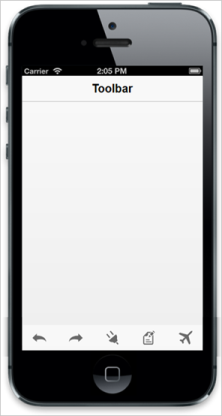

# Configure icons

You can use different icons in your Toolbar and also you can customize these icons for each item by using the IconName property.

The following built-in icons can be used in Toolbar.

1.    Add
2.    Back
3.    Bookmark
4.    Close
5.    Compose
6.    Copy
7.    Cut
8.    Delete
9.    Done
10.   Edit
11.   Mail
12.   Next
13.   Refresh
14.   Overflow
15.   Paste
16.   Reply
17.   Save
18.   Search
19.   Settings
20.   Share

Refer to the following code example.



@Html.EJMobile().Toolbar("toolbar_sample").Items(items =>

   {

       items.Add().IconName(IconName.Add);

       items.Add().IconName(IconName.Cut);

       items.Add().IconName(IconName.Copy);

       items.Add().IconName(IconName.Save);

       items.Add().IconName(IconName.Search);

   })



The following screenshot illustrates the output of the above code.

You can set the user defined icons using IconUrl property. This property overrides the IconName property when both properties are set at a time. 



    @Html.EJMobile().Toolbar("sample-toolbar").Items(items =>

   {

       items.Add().IconUrl("http://js.syncfusion.com/UG/Mobile/Content/toolbar/back.png");

       items.Add().IconUrl("http://js.syncfusion.com/UG/Mobile/Content/toolbar/forward.png");

       items.Add().IconUrl("http://js.syncfusion.com/UG/Mobile/Content/toolbar/plugin.png");

       items.Add().IconUrl("http://js.syncfusion.com/UG/Mobile/Content/toolbar/edit.png");

       items.Add().IconUrl("http://js.syncfusion.com/UG/Mobile/Content/toolbar/airoplane_mode.png");

   })



 The following screenshot illustrates the output of the above code.

