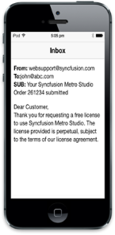
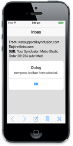

# Getting Started

## Create your first Toolbar in MVC

The Essential Studio for ASP.NET MVC Mobile Toolbar provides a single interface to select a command from a collection of commands. It provides template support. In this example, you can learn how to create a Mail App and through that you can learn the features of Mobile Toolbar Widget.

### Create the necessary layout

Create a simple MVC application and paste the following header and scrollpanel layout page content inside the <body> tag of layout.cshtml. Add other templates in the view page for Toolbar creation. To create a MVC Project, add necessary Dll’s and Scripts done with the help of the [MVC-Getting Started Documentation](http://help.syncfusion.com/ug/js/default.htm) for mobile.



     @Html.EJMobile().Header("header").Position(MobileHeaderPosition.Normal).Title("inbox")

    

        @RenderBody()

    

@Html.EJMobile().Scrollpanel("scroll").Target("content")

 Add the following code in the corresponding view page.

<!--Add Toolbar control here. -->

<!-- Inbox sample content-->

    <b>From:</b> websupport@syncfusion.com  

    <b>To:</b>john@abc.com  

 <b>SUB:</b> Your Syncfusion Metro Studio Order 261234 submitted  

    

        Dear Customer,  

        Thank you for requesting a free license to use Syncfusion Metro Studio. The license provided is perpetual, subject to the terms of our license agreement.

    

@Html.EJMobile().Dialog("alertdlg").Title("Dialog").LeftButtonCaption("OK").ClientSideEvents(c => c.ButtonTap("alertClose"))



Execute this code to render the following output.

### Create Toolbar Control

To render the Toolbar control, add the following code and include a list of Toolbar items to be added. There are 20 built-in icons for Toolbar items. This can be achieved by using the IconName property.



@Html.EJMobile().Toolbar("toolbar") .Position(Position.Normal) .Android(android=>android.Position(AndroidToolbarPosition.Fixed) .Title("Inbox")).Windows(windows=>windows.Position(WindowsToolbarPosition.Fixed)).Items(item =>

            {

                item.Add().IconName(IconName.Back);

                item.Add().IconName(IconName.Next);

                item.Add().IconName(IconName.Compose);

                item.Add().IconName(IconName.Delete);

                item.Add().IconName(IconName.Close);

            })

 Use the following styles for content style.

        

 Execute this code to render the following output.



### Add Functionalities for toolbar items 

You can provide functionalities for each Toolbar items and this can be achieved by adding TouchEnd event. When you click the Toolbar item, its corresponding TouchEnd event triggers and it is handled using the performAction function as shown in the following code example. 



@Html.EJMobile().Toolbar("toolbar").ClientSideEvents(c => c.TouchEnd("performAction")).Position(Position.Normal) .Android(android=>android.Position(Position.Fixed)).Windows(windows=>windows.Position(Position.Fixed)).Items(item =>

            {

                item.Add().IconName(IconName.Back);

                item.Add().IconName(IconName.Next);

                item.Add().IconName(IconName.Compose);

                item.Add().IconName(IconName.Delete);

                item.Add().IconName(IconName.Close);

            })





 



  Execute this code to render the following output.

